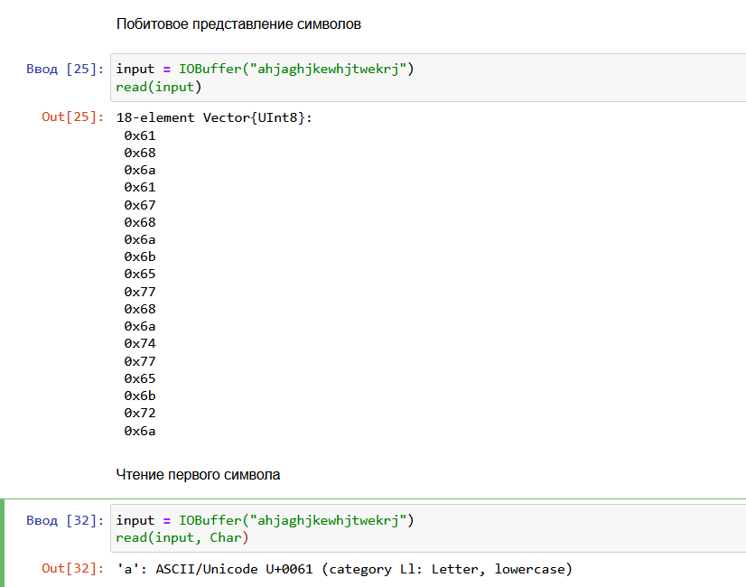
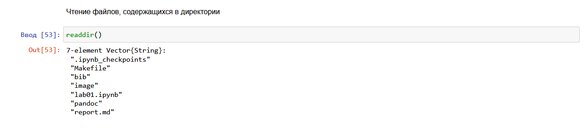

---
## Front matter
lang: ru-RU
title: Лабораторная работа №1
subtitle: Компьютерный практикум по статистическому анализу данных
author:
  - Николаев Дмитрий Иванович
institute:
  - Российский университет дружбы народов, Москва, Россия
group:
  - НКНбд-01-20

## i18n babel
babel-lang: russian
babel-otherlangs: english

## Formatting pdf
toc: false
toc-title: Содержание
slide_level: 2
aspectratio: 169
section-titles: true
theme: metropolis
header-includes:
 - \metroset{progressbar=frametitle,sectionpage=progressbar,numbering=fraction}
 - '\makeatletter'
 - '\beamer@ignorenonframefalse'
 - '\makeatother'
---

# Прагматика выполнения

- Получение навыков работы в Jupyter Notebook
- Освоение базовых особенностей языка Julia

# Цель

Основная цель работы --- подготовить рабочее пространство и инструментарий для
работы с языком программирования Julia, на простейших примерах познакомиться
с основами синтаксиса Julia.

# Задачи

1. Установите под свою операционную систему Julia, Jupyter (разделы 1.3.1 и 1.3.2).

2. Используя Jupyter Lab, повторите примеры из раздела 1.3.3.

3. Выполните задания для самостоятельной работы (раздел 1.3.4).

# Выполнение работы

## Повторение примеров из пункта 1.3.3 (1/3)

{#fig:001 width=70%}

## Повторение примеров из пункта 1.3.3 (2/3)

{#fig:002 width=70%}

## Повторение примеров из пункта 1.3.3 (3/3)

{#fig:003 width=70%}

## Команда read (1/2)

{#fig:005 width=70%}

## Команда read (2/2)

{#fig:006 width=70%}

## Команда readline

{#fig:008 width=70%}

## Команда readlines

{#fig:010 width=70%}

## Команда readdir

{#fig:012 width=70%}

## Команда print

{#fig:013 width=70%}

## Команда println

{#fig:014 width=70%}

## Команда show

{#fig:016 width=70%}

## Команда write

{#fig:018 width=70%}

## Команда parse

{#fig:020 width=70%}

## Оператор сложения

{#fig:021 width=70%}

## Операторы вычитания, умножения и деления

{#fig:022 width=70%}

## Возведение в степень, извлечение корня, операторы сравнения и логические операции

{#fig:023 width=70%}

## Работа с векторами и матрицами (1/3)

{#fig:024 width=70%}

## Работа с векторами и матрицами (2/3)

{#fig:025 width=70%}

## Работа с векторами и матрицами (3/3)

{#fig:026 width=70%}

# Результаты

В ходе работы я освоил основы языка Julia: работа с командами ввода/вывода, простейшие математические операции, операторы сравнения и логические операции.
