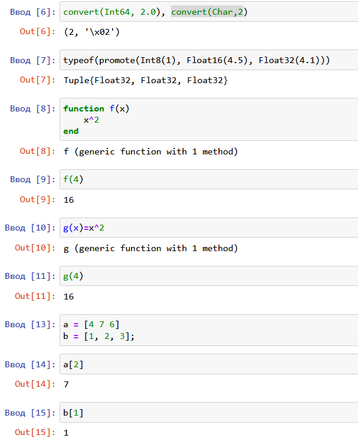
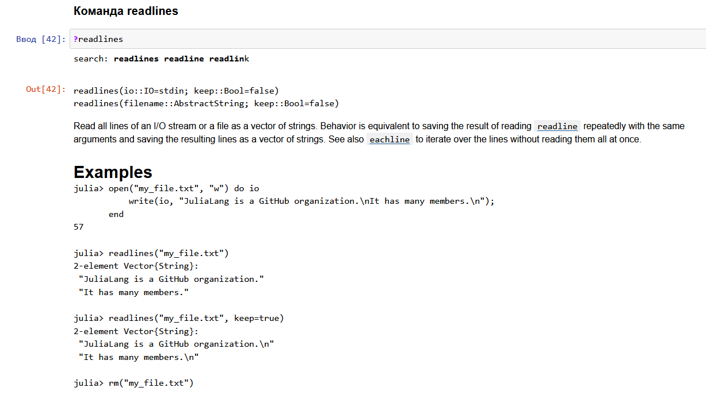
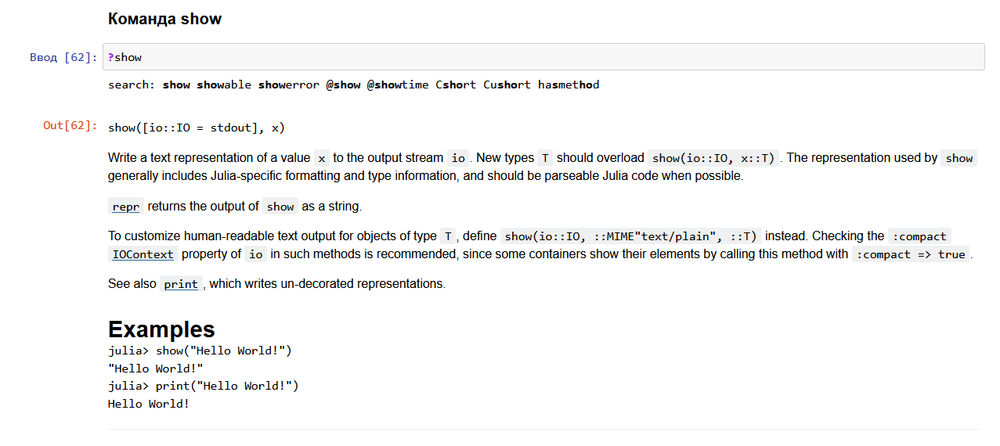

---
## Front matter
title: "Лабораторная работа №1"
subtitle: "Компьютерный практикум по статистическому анализу данных"
author: "Николаев Дмитрий Иванович"
institute:
  - Российский университет дружбы народов, Москва, Россия
group:
  - НКНбд-01-20

## Generic otions
lang: ru-RU
toc-title: "Содержание"

## Bibliography
bibliography: bib/cite.bib
csl: pandoc/csl/gost-r-7-0-5-2008-numeric.csl

## Pdf output format
toc: true # Table of contents
toc-depth: 2
lof: true # List of figures
lot: true # List of tables
fontsize: 12pt
linestretch: 1.5
papersize: a4
documentclass: scrreprt
## I18n polyglossia
polyglossia-lang:
  name: russian
  options:
	- spelling=modern
	- babelshorthands=true
polyglossia-otherlangs:
  name: english
## I18n babel
babel-lang: russian
babel-otherlangs: english
## Fonts
mainfont: PT Serif
romanfont: PT Serif
sansfont: PT Sans
monofont: PT Mono
mainfontoptions: Ligatures=TeX
romanfontoptions: Ligatures=TeX
sansfontoptions: Ligatures=TeX,Scale=MatchLowercase
monofontoptions: Scale=MatchLowercase,Scale=0.9
## Biblatex
biblatex: true
biblio-style: "gost-numeric"
biblatexoptions:
  - parentracker=true
  - backend=biber
  - hyperref=auto
  - language=auto
  - autolang=other*
  - citestyle=gost-numeric
## Pandoc-crossref LaTeX customization
figureTitle: "Рис."
tableTitle: "Таблица"
listingTitle: "Листинг"
lofTitle: "Список иллюстраций"
lotTitle: "Список таблиц"
lolTitle: "Листинги"
## Misc options
indent: true
header-includes:
  - \usepackage{indentfirst}
  - \usepackage{float} # keep figures where there are in the text
  - \floatplacement{figure}{H} # keep figures where there are in the text
---

# Цель работы

Основная цель работы --- подготовить рабочее пространство и инструментарий для
работы с языком программирования Julia, на простейших примерах познакомиться
с основами синтаксиса Julia.

# Ход работы

Следуем указаниям из [@lab1]. Осваиваем основы работы в Julia в Jupyter.

## Повторение примеров из пункта 1.3.3

Определение и приведение типов данных [@fig:001], определение функций [@fig:002] и работа с векторами и матрицами [@fig:003].

{#fig:001 width=70%}

{#fig:002 width=70%}

{#fig:003 width=70%}

## Задания для самостоятельного выполнения

### Пункт 1

Изучим команду read(). Вызовем справку [@fig:004] и проверим работу команды. Ее можно использовать для чтения битового представления символов строки, чтения первого символа строки [@fig:005], чтение целой строки и конкретного числа символов из строки [@fig:006].

{#fig:004 width=70%}

{#fig:005 width=70%}

{#fig:006 width=70%}

Изучим команду readline(). Вызовем справку [@fig:007] и проверим работу команды. Ее можно использовать для чтения строки из файла или потока ввода/вывода. Считаем вывод с клавиатуры [@fig:008].

{#fig:007 width=70%}

{#fig:008 width=70%}

Изучим команду readlines(). Вызовем справку [@fig:009] и проверим работу команды. Ее можно использовать для чтения множества строк из файла или потока ввода/вывода. Считаем строки из созданного текстового файла [@fig:010].

{#fig:009 width=70%}

{#fig:010 width=70%}

Изучим команду readdir(). Вызовем справку [@fig:011] и проверим работу команды. Она считывает файлы из конкретной директории, по умолчанию считывает файлы из рабочей директории [@fig:012].

{#fig:011 width=70%}

{#fig:012 width=70%}

Изучим команду print(). Вызовем справку и сделаем проверим работу команды [@fig:013]. Она печатает текст из переданного аргумента, не переносит текст на следующую строку.

{#fig:013 width=70%}

Изучим команду println(). Вызовем справку и сделаем проверим работу команды [@fig:014]. Она печатает текст из переданного аргумента и переносит текст на следующую строку.

{#fig:014 width=70%}

Изучим команду show(). Вызовем справку [@fig:015] и проверим работу команды. Она работает как команда print, но при печати сохраняет особенности типов данных [@fig:016].

{#fig:015 width=70%}

{#fig:016 width=70%}

Изучим команду write(). Вызовем справку [@fig:017] и проверим работу команды. Она позволяет записывать информацию в файл (переданный аргумент или набор аргументов) [@fig:018].

{#fig:017 width=70%}

{#fig:018 width=70%}

### Пункт 2

Изучим команду parse(). Вызовем справку [@fig:019] и проверим работу команды. Она переводит строку в число заданного типа [@fig:020].

{#fig:019 width=70%}

{#fig:020 width=70%}

### Пункт 3

Изучим оператор сложения "+". Вызовем справку и проверим работу оператор [@fig:021]. Он складывает числа и приводит результат к наиболее общему типу данных.

{#fig:021 width=70%}

Проверим работу операторов вычитания "-", умножения "*" и деления "/" [@fig:022]. Они выполняют соответствующие математические операции с аналогичным сложению приведением типов для вычитания и умножения, а при делении всегда получаем число с плавающей точкой.

{#fig:022 width=70%}

Проверим операции возведения в степень "^", извлечения корня "sqrt", операторов сравнения и логических операций [@fig:023]. Любые числа возводятся в любую степень (вплоть до комплексных) и $0^0 = 1$; извлечение корня производится из любого числа, за исключением отрицательных (если они не имеют тип Complex); операторы сравнения и логические операции аналогичны классическим с оператором "===", который дополнительно проверяет совпадение типов чисел.

{#fig:023 width=70%}

### Пункт 4

Создадим вектор-строку, вектор-столбец (путем транспонирования строки), матрицу и попробуем сложить строку и столбец [@fig:024]. Так как размерности не соответствуют, то сложение выполнить невозможно.

{#fig:024 width=70%}

Сложим векторы с одинаковой размерностью. Перемножив вектор-строку на вектор-столбец другого вектора, получим их скалярное произведение (если взять корень из скалярного произведения вектора-строки на ее транспонированную версию, то получим норму данного вектора (в евклидовом пространстве)); перемножим матрицу на матрицу и матрицу (или вектор) на число, данные операции аналогичны математическим [@fig:025]. Перемножив вектор-строку на матрицу и матрицу на вектор-столбец, получим строку и столбец соответственно; умножив матрицу слева на вектор-строку, а справа на вектор-столбец, получим число (таким образом можно реализовать тензоры) [@fig:026].

{#fig:025 width=70%}

{#fig:026 width=70%}

# Выводы

В ходе выполнения данной лабораторной работы я освоил основы языка Julia: работа с командами ввода/вывода, простейшие математические операции, операторы сравнения и логические операции.

# Список литературы{.unnumbered}

::: {#refs}
:::
