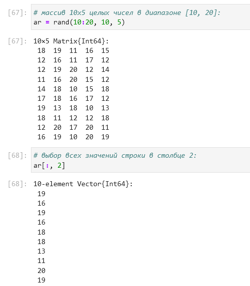
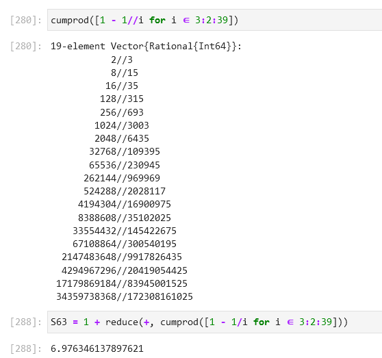

---
## Front matter
lang: ru-RU
title: Лабораторная работа №2
subtitle: Компьютерный практикум по статистическому анализу данных
author:
  - Николаев Д. И.
institute:
  - Российский университет дружбы народов, Москва, Россия
date: 15 ноября 2023

## i18n babel
babel-lang: russian
babel-otherlangs: english

## Formatting pdf
toc: false
toc-title: Содержание
slide_level: 2
aspectratio: 169
section-titles: true
theme: metropolis
header-includes:
 - \metroset{progressbar=frametitle,sectionpage=progressbar,numbering=fraction}
 - '\makeatletter'
 - '\beamer@ignorenonframefalse'
 - '\makeatother'
---

# Прагматика выполнения

- Получение навыков работы в Jupyter Notebook;
- Освоение особенностей языка Julia;
- Применение полученных знаний на практике в дальнейшем.

# Цели

Основная цель работы --- изучить несколько структур данных, реализованных в Julia,
научиться применять их и операции над ними для решения задач

# Задачи

1. Используя Jupyter Lab, повторить примеры из раздела 2.2.
2. Выполнить задания для самостоятельной работы (раздел 2.4).

# Выполнение работы. Повторение примеров

## Повторение примеров (1)

{#fig:001 width=70%}

## Повторение примеров (2)

{#fig:002 width=70%}

## Повторение примеров (3)

{#fig:003 width=70%}

## Повторение примеров (4)

{#fig:004 width=70%}

## Повторение примеров (5)

{#fig:005 width=70%}

## Повторение примеров (6)

{#fig:006 width=70%}

## Повторение примеров (7)

{#fig:007 width=70%}

## Повторение примеров (8)

{#fig:008 width=70%}

## Повторение примеров (9)

{#fig:009 width=70%}

## Повторение примеров (10)

{#fig:010 width=70%}

## Повторение примеров (11)

{#fig:011 width=70%}

## Повторение примеров (12)

{#fig:012 width=70%}

## Повторение примеров (13)

{#fig:013 width=70%}

## Повторение примеров (14)

{#fig:014 width=70%}

## Повторение примеров (15)

{#fig:015 width=70%}

## Повторение примеров (16)

{#fig:016 width=70%}

## Повторение примеров (17)

{#fig:017 width=70%}

## Повторение примеров (18)

{#fig:018 width=70%}

# Выполнение работы. Самостоятельная работа

## Задание 1

{#fig:019 width=70%}

## Задание 2 (1)

{#fig:020 width=70%}

## Задание 2 (2)

{#fig:021 width=70%}

## Задание 3. Пункт 1 (1)

{#fig:022 width=70%}

## Задание 3. Пункт 1 (2)

{#fig:023 width=70%}

## Задание 3. Пункт 2

{#fig:024 width=70%}

## Задание 3. Пункт 3, 4

{#fig:025 width=70%}

## Задание 3. Пункт 5

{#fig:026 width=70%}

## Задание 3. Пункт 6

{#fig:027 width=70%}

## Задание 3. Пункт 7

{#fig:028 width=70%}

## Задание 3. Пункт 8 (1)

{#fig:030 width=70%}

## Задание 3. Пункт 1 (2)

{#fig:031 width=70%}

## Задание 3. Пункт 9

{#fig:032 width=70%}

## Задание 3. Пункт 10

{#fig:033 width=70%}

## Задание 3. Пункт 11

{#fig:034 width=70%}

## Задание 3. Пункт 12

{#fig:035 width=70%}

## Задание 3. Пункт 13

{#fig:036 width=70%}

## Задание 3. Пункт 14. Подпункт 1 (1)

{#fig:037 width=70%}

## Задание 3. Пункт 14. Подпункт 1 (2)

{#fig:038 width=70%}

## Задание 3. Пункт 14. Подпункт 2

{#fig:039 width=70%}

## Задание 3. Пункт 14. Подпункт 3

{#fig:040 width=70%}

## Задание 3. Пункт 14. Подпункт 4

{#fig:041 width=70%}

## Задание 3. Пункт 14. Подпункт 5

{#fig:042 width=70%}

## Задание 3. Пункт 14. Подпункт 6 (1)

{#fig:043 width=70%}

## Задание 3. Пункт 14. Подпункт 6 (2)

{#fig:044 width=70%}

## Задание 3. Пункт 14. Подпункт 7

{#fig:045 width=70%}

## Задание 3. Пункт 14. Подпункт 8

{#fig:046 width=70%}

## Задание 3. Пункт 14. Подпункт 9 (1)

{#fig:047 width=70%}

## Задание 3. Пункт 14. Подпункт 9 (2)

{#fig:048 width=70%}

## Задание 3. Пункт 14. Подпункт 10

{#fig:049 width=70%}

## Задание 3. Пункт 14. Подпункт 11

{#fig:050 width=70%}

## Задание 3. Пункт 14. Подпункт 12 (1)

{#fig:051 width=70%}

## Задание 3. Пункт 14. Подпункт 12 (2)

{#fig:052 width=70%}

## Задание 3. Пункт 14. Подпункт 13

{#fig:053 width=70%}

## Задание 3. Пункт 14. Подпункт 14

{#fig:054 width=70%}

## Задание 4

{#fig:055 width=70%}

## Задание 5 (1)

{#fig:056 width=70%}

## Задание 5 (2)

{#fig:057 width=70%}

## Задание 5 (3)

{#fig:058 width=70%}

## Задание 6. Пункт 1

{#fig:059 width=70%}

## Задание 6. Пункт 2

{#fig:060 width=70%}

## Задание 6. Пункт 3 (1)

{#fig:061 width=70%}

## Задание 6. Пункт 3 (2)

{#fig:062 width=70%}

# Результаты

В ходе работы я изучил структуры данных, реализованные в Julia, и операция над ними для решения практических задач
