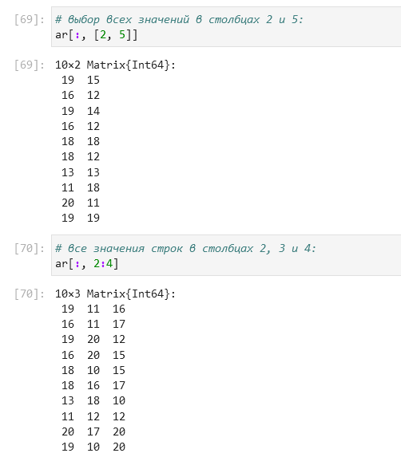

---
## Front matter
title: "Лабораторная работа №2"
subtitle: "Компьютерный практикум по статистическому анализу данных"
author: "Николаев Дмитрий Иванович"

## Generic otions
lang: ru-RU
toc-title: "Содержание"

## Bibliography
bibliography: bib/cite.bib
csl: pandoc/csl/gost-r-7-0-5-2008-numeric.csl

## Pdf output format
toc: true # Table of contents
toc-depth: 2
lof: true # List of figures
lot: true # List of tables
fontsize: 12pt
linestretch: 1.5
papersize: a4
documentclass: scrreprt
## I18n polyglossia
polyglossia-lang:
  name: russian
  options:
	- spelling=modern
	- babelshorthands=true
polyglossia-otherlangs:
  name: english
## I18n babel
babel-lang: russian
babel-otherlangs: english
## Fonts
mainfont: PT Serif
romanfont: PT Serif
sansfont: PT Sans
monofont: PT Mono
mainfontoptions: Ligatures=TeX
romanfontoptions: Ligatures=TeX
sansfontoptions: Ligatures=TeX,Scale=MatchLowercase
monofontoptions: Scale=MatchLowercase,Scale=0.9
## Biblatex
biblatex: true
biblio-style: "gost-numeric"
biblatexoptions:
  - parentracker=true
  - backend=biber
  - hyperref=auto
  - language=auto
  - autolang=other*
  - citestyle=gost-numeric
## Pandoc-crossref LaTeX customization
figureTitle: "Рис."
tableTitle: "Таблица"
listingTitle: "Листинг"
lofTitle: "Список иллюстраций"
lotTitle: "Список таблиц"
lolTitle: "Листинги"
## Misc options
indent: true
header-includes:
  - \usepackage{indentfirst}
  - \usepackage{float} # keep figures where there are in the text
  - \floatplacement{figure}{H} # keep figures where there are in the text
---

# Цель работы

Основная цель работы --- изучить несколько структур данных, реализованных в Julia,
научиться применять их и операции над ними для решения задач.

# Выполнение лабораторной работы

Выполняем задания согласно указаниям [@lab2].

## Повторение примеров

Повторим примеры, представленные в лабораторной работе. Работа с кортежами ([@fig:001,@fig:002]), словарями ([@fig:003,@fig:004]), множествами ([@fig:005-@fig:007]) и массивами ([@fig:008-@fig:018]).

{#fig:001 width=70%}

{#fig:002 width=70%}

{#fig:003 width=70%}

{#fig:004 width=70%}

{#fig:005 width=70%}

{#fig:006 width=70%}

{#fig:007 width=70%}

{#fig:008 width=70%}

{#fig:009 width=70%}

{#fig:010 width=70%}

{#fig:011 width=70%}

{#fig:012 width=70%}

{#fig:013 width=70%}

{#fig:014 width=70%}

{#fig:015 width=70%}

{#fig:016 width=70%}

{#fig:017 width=70%}

{#fig:018 width=70%}

## Самостоятельная работа

1. Выполняем заданные операции с множествами ([@fig:019])

    {#fig:019 width=70%}

2. Приведем несколько примером операций с множествами разных типов ([@fig:020,@fig:021])

    {#fig:020 width=70%}

    {#fig:021 width=70%}

3. Создадим массивы разными способами (задания написаны на скриншотах).

    1) Пункт 1 ([@fig:022,@fig:023])

        {#fig:022 width=70%}

        {#fig:023 width=70%}

    2) Пункт 2 ([@fig:024])

        {#fig:024 width=70%}

    3) Пункт 3 и 4 ([@fig:025])

        {#fig:025 width=70%}

    4) Пункт 5 ([@fig:026])

        {#fig:026 width=70%}

    5) Пункт 6 ([@fig:027])

        {#fig:027 width=70%}

    6) Пункт 7 ([@fig:028,@fig:029])

        {#fig:028 width=70%}

        {#fig:029 width=70%}

    7) Пункт 8 ([@fig:030,@fig:031])

        {#fig:030 width=70%}

        {#fig:031 width=70%}

    8) Пункт 9 ([@fig:032])

        {#fig:032 width=70%}

    9) Пункт 10 ([@fig:033])

        {#fig:033 width=70%}

    10) Пункт 11 ([@fig:034])

        {#fig:034 width=70%}

    11) Пункт 12 ([@fig:035])

        {#fig:035 width=70%}

    12) Пункт 13 ([@fig:036])

        {#fig:036 width=70%}

    13) Пункт 14:

        - Подпункт 1 ([@fig:037,@fig:038])

            {#fig:037 width=70%}

            {#fig:038 width=70%}

        - Подпункт 2 ([@fig:039])

            {#fig:039 width=70%}

        - Подпункт 3 ([@fig:040])

            {#fig:040 width=70%}

        - Подпункт 4 ([@fig:041])

            {#fig:041 width=70%}

        - Подпункт 5 ([@fig:042])

            {#fig:042 width=70%}

        - Подпункт 6 ([@fig:043,@fig:044])

            {#fig:043 width=70%}

            {#fig:044 width=70%}

        - Подпункт 7 ([@fig:045])

            {#fig:045 width=70%}

        - Подпункт 8 ([@fig:046])

            {#fig:046 width=70%}

        - Подпункт 9 ([@fig:047,@fig:048])

            {#fig:047 width=70%}

            {#fig:048 width=70%}

        - Подпункт 10 ([@fig:049])

            {#fig:049 width=70%}

        - Подпункт 11 ([@fig:050])

            {#fig:050 width=70%}

        - Подпункт 12 ([@fig:051,@fig:052])

            {#fig:051 width=70%}

            {#fig:052 width=70%}

        - Подпункт 13 ([@fig:053])

            {#fig:053 width=70%}

        - Подпункт 14 ([@fig:054])

            {#fig:054 width=70%}

4. Создадим массив квадратов от 1 до 100 ([@fig:055])

    {#fig:055 width=70%}

5. Работа с пакетом Primes ([@fig:056-@fig:058])

    {#fig:056 width=70%}

    {#fig:057 width=70%}

    {#fig:058 width=70%}

6. Вычислим различные выражения:

    1) Пункт 1 ([@fig:059])

        {#fig:059 width=70%}

    2) Пункт 2 ([@fig:060])

        {#fig:060 width=70%}

    3) Пункт 3 ([@fig:061,@fig:062])

        {#fig:061 width=70%}

        {#fig:062 width=70%}

# Выводы

В ходе выполнения лабораторной работы я изучил структуры данных, реализованные в Julia, и операция над ними для решения практических задач.

# Список литературы{.unnumbered}

::: {#refs}
:::
