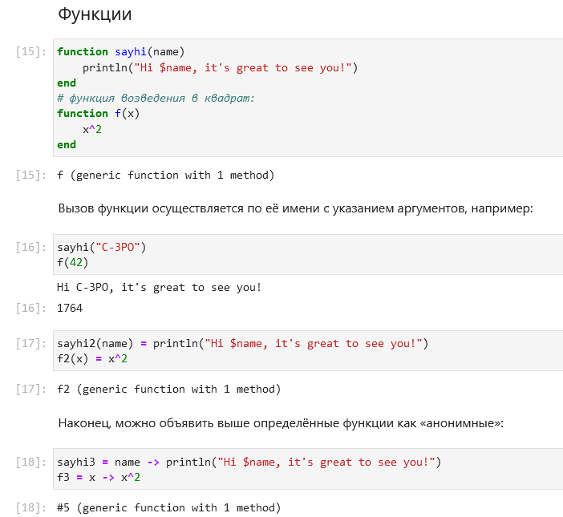
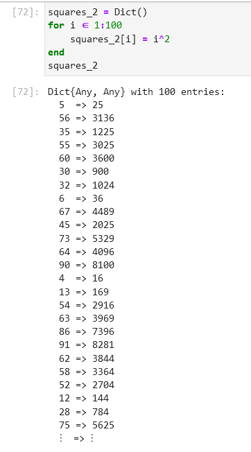

---
## Front matter
title: "Лабораторная работа №3"
subtitle: "Компьютерный практикум по статистическому анализу данных"
author: "Николаев Дмитрий Иванович"

## Generic otions
lang: ru-RU
toc-title: "Содержание"

## Bibliography
bibliography: bib/cite.bib
csl: pandoc/csl/gost-r-7-0-5-2008-numeric.csl

## Pdf output format
toc: true # Table of contents
toc-depth: 2
lof: true # List of figures
lot: true # List of tables
fontsize: 12pt
linestretch: 1.5
papersize: a4
documentclass: scrreprt
## I18n polyglossia
polyglossia-lang:
  name: russian
  options:
	- spelling=modern
	- babelshorthands=true
polyglossia-otherlangs:
  name: english
## I18n babel
babel-lang: russian
babel-otherlangs: english
## Fonts
mainfont: PT Serif
romanfont: PT Serif
sansfont: PT Sans
monofont: PT Mono
mainfontoptions: Ligatures=TeX
romanfontoptions: Ligatures=TeX
sansfontoptions: Ligatures=TeX,Scale=MatchLowercase
monofontoptions: Scale=MatchLowercase,Scale=0.9
## Biblatex
biblatex: true
biblio-style: "gost-numeric"
biblatexoptions:
  - parentracker=true
  - backend=biber
  - hyperref=auto
  - language=auto
  - autolang=other*
  - citestyle=gost-numeric
## Pandoc-crossref LaTeX customization
figureTitle: "Рис."
tableTitle: "Таблица"
listingTitle: "Листинг"
lofTitle: "Список иллюстраций"
lotTitle: "Список таблиц"
lolTitle: "Листинги"
## Misc options
indent: true
header-includes:
  - \usepackage{indentfirst}
  - \usepackage{float} # keep figures where there are in the text
  - \floatplacement{figure}{H} # keep figures where there are in the text
---

# Цель работы

Основная цель работы --- освоить применение циклов функций и сторонних для Julia
пакетов для решения задач линейной алгебры и работы с матрицами.

# Выполнение лабораторной работы

Выполняем задания, следуя указаниям [@lab3].

## Повторение примеров

Повторим примеры, представленные в лабораторной работе. Циклы while и for ([@fig:001-@fig:004]), Условные выражения ([@fig:005]), функции ([@fig:006-@fig:010]) и сторонние библиотеки/пакеты ([@fig:011,@fig:012]).

{#fig:001 width=70%}

{#fig:002 width=70%}

{#fig:003 width=70%}

{#fig:004 width=70%}

{#fig:005 width=70%}

{#fig:006 width=70%}

{#fig:007 width=70%}

{#fig:008 width=70%}

{#fig:009 width=70%}

{#fig:010 width=70%}

{#fig:011 width=70%}

{#fig:012 width=70%}

## Самостоятельная работа

1. Используем циклы while и for (задания написаны на скриншотах):

    1) Пункт 1 ([@fig:013])

        {#fig:013 width=70%}

    2) Пункт 2 ([@fig:014,@fig:015])

        {#fig:014 width=70%}

        {#fig:015 width=70%}

    3) Пункт 3 ([@fig:016,@fig:017])

        {#fig:016 width=70%}

        {#fig:017 width=70%}

2. Напишем условное выражение, используя тернарный оператор ([@fig:018])

    {#fig:018 width=70%}

3. Напишем функцию добавления единицы к аргументу ([@fig:019])

    {#fig:019 width=70%}

4. Создадим матрицу, элементы которой различаются на единицу ([@fig:020])

    {#fig:020 width=70%}

5. Работа с матрицей определенного вида (задания написаны на скриншотах):

    1) Пункт 1 ([@fig:021])

        {#fig:021 width=70%}

    2) Пункт 2 ([@fig:022])

        {#fig:022 width=70%}

    3) Пункт 3 ([@fig:023])

        {#fig:023 width=70%}

6. Создадим матрицу ([@fig:024]) и вычислим ее произведение с транспонированной версией ([@fig:025]).

    {#fig:024 width=70%}

    {#fig:025 width=70%}

7. Создадим 4 матрицы с некоторыми закономерностями ([@fig:026-@fig:030]).

    {#fig:026 width=70%}

    {#fig:027 width=70%}

    {#fig:028 width=70%}

    {#fig:029 width=70%}

    {#fig:030 width=70%}

8. Написание функции outer (внешнее произведение, с возможностью замены операции) и построение матриц с ее помощью (задания написаны на скриншотах):

    1) Пункт 1 ([@fig:031])

        {#fig:031 width=70%}

    2) Пункт 2 --- создаем матрицы разной структуры ([@fig:032-@fig:034])

        {#fig:032 width=70%}

        {#fig:033 width=70%}

        {#fig:034 width=70%}

9. Решим систему уравнений определенного вида. Составим матрицу коэффициентов ([@fig:035]), реализуем метод Гаусса ([@fig:036]) и найдем решение системы уравнений ([@fig:037]).

    {#fig:035 width=70%}

    {#fig:036 width=70%}

    {#fig:037 width=70%}

10. Создадим матрицу со случайными целыми числами ([@fig:038]) и проведем с ней несколько операций (задания написаны на скриншотах):

    {#fig:038 width=70%}

    1) Пункт 1 ([@fig:039])

        {#fig:039 width=70%}

    2) Пункт 2 ([@fig:040])

        {#fig:040 width=70%}

    3) Пункт 3 ([@fig:041])

        {#fig:041 width=70%}

11. Найдем две суммы ([@fig:042,@fig:043]).

    {#fig:042 width=70%}

    {#fig:043 width=70%}

# Выводы

В ходе выполнения лабораторной работы я освоил работу с циклами и сторонние библиотеки Julia для решения задач линейной алгебры и работы с матрицами.

# Список литературы{.unnumbered}

::: {#refs}
:::
