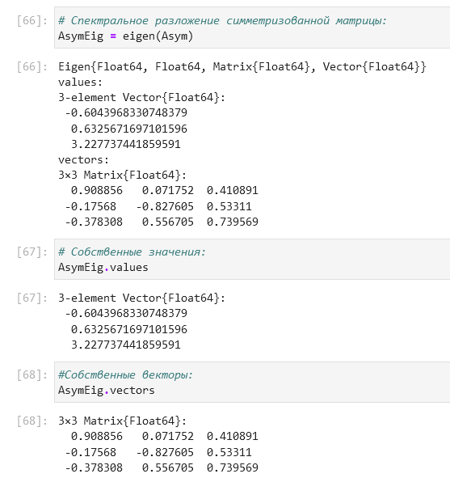

---
## Front matter
lang: ru-RU
title: Лабораторная работа №4
subtitle: Компьютерный практикум по статистическому анализу данных
author:
  - Николаев Д. И.
institute:
  - Российский университет дружбы народов, Москва, Россия
date: 18 ноября 2023

## i18n babel
babel-lang: russian
babel-otherlangs: english

## Formatting pdf
toc: false
toc-title: Содержание
slide_level: 2
aspectratio: 169
section-titles: true
theme: metropolis
header-includes:
 - \metroset{progressbar=frametitle,sectionpage=progressbar,numbering=fraction}
 - '\makeatletter'
 - '\beamer@ignorenonframefalse'
 - '\makeatother'
---

# Прагматика выполнения

- Получение навыков работы в Jupyter Notebook;
- Освоение особенностей языка Julia;
- Применение полученных знаний на практике в дальнейшем.

# Цели

Основной целью работы является изучение возможностей специализированных пакетов Julia для выполнения и оценки эффективности операций над объектами линейной
алгебры

# Задачи

1. Используя Jupyter Lab, повторите примеры из раздела 4.2.
2. Выполните задания для самостоятельной работы (раздел 4.4).

# Повторение примеров

## Поэлементные операции над многомерными массивами (1)

{#fig:001 width=70%}

## Поэлементные операции над многомерными массивами (2)

{#fig:002 width=70%}

## Поэлементные операции над многомерными массивами (3)

{#fig:003 width=70%}

## Транспонирование, след, ранг, определитель и инверсия матрицы (1)

{#fig:004 width=70%}

## Транспонирование, след, ранг, определитель и инверсия матрицы (2)

{#fig:005 width=70%}

## Вычисление нормы векторов и матриц, повороты, вращения (1)

{#fig:006 width=70%}

## Вычисление нормы векторов и матриц, повороты, вращения (2)

{#fig:007 width=70%}

## Вычисление нормы векторов и матриц, повороты, вращения (3)

{#fig:008 width=70%}

## Матричное умножение, единичная матрица, скалярное произведение и массивами (1)

{#fig:009 width=70%}

## Матричное умножение, единичная матрица, скалярное произведение и массивами (2)

{#fig:010 width=70%}

## Факторизация, специальные матричные структуры (1)

{#fig:011 width=70%}

## Факторизация, специальные матричные структуры (2)

{#fig:012 width=70%}

## Факторизация, специальные матричные структуры (3)

{#fig:013 width=70%}

## Факторизация, специальные матричные структуры (4)

{#fig:014 width=70%}

## Факторизация, специальные матричные структуры (5)

{#fig:015 width=70%}

## Факторизация, специальные матричные структуры (6)

{#fig:016 width=70%}

## Факторизация, специальные матричные структуры (7)

{#fig:017 width=70%}

## Факторизация, специальные матричные структуры (8)

{#fig:018 width=70%}

## Факторизация, специальные матричные структуры (9)

{#fig:019 width=70%}

## Факторизация, специальные матричные структуры (10)

{#fig:020 width=70%}

## Факторизация, специальные матричные структуры (11)

{#fig:021 width=70%}

## Факторизация, специальные матричные структуры (12)

{#fig:022 width=70%}

## Факторизация, специальные матричные структуры (13)

{#fig:023 width=70%}

## Факторизация, специальные матричные структуры (14)

{#fig:024 width=70%}

## Общая линейная алгебра (1)

{#fig:025 width=70%}

## Общая линейная алгебра (2)

{#fig:026 width=70%}

# Самостоятельное задание

## Задание 4.4.1. Произведение векторов

{#fig:027 width=70%}

## Задание 4.4.2. Системы линейных уравнений

{#fig:028 width=70%}

## Задание 4.4.2. Номер 1. Пункт a

{#fig:029 width=70%}

## Задание 4.4.2. Номер 1. Пункты b, c и d

{#fig:030 width=70%}

## Задание 4.4.2. Номер 1. Пункты e и f

{#fig:031 width=70%}

## Задание 4.4.2. Номер 2. Пункты a и b

{#fig:032 width=70%}

## Задание 4.4.2. Номер 2. Пункт c

{#fig:033 width=70%}

## Задание 4.4.2. Номер 2. Пункт d

{#fig:034 width=70%}

## Задание 4.4.3. Номер 1. Пункт a (1)

{#fig:035 width=70%}

## Задание 4.4.3. Номер 1. Пункт a (2)

{#fig:036 width=70%}

## Задание 4.4.3. Номер 1. Пункт b

{#fig:037 width=70%}

## Задание 4.4.3. Номер 1. Пункт c (1)

{#fig:038 width=70%}

## Задание 4.4.3. Номер 1. Пункт c (2)

{#fig:039 width=70%}

## Задание 4.4.3. Номер 2. Пункт a

{#fig:040 width=70%}

## Задание 4.4.3. Номер 2. Пункт b (1)

{#fig:041 width=70%}

## Задание 4.4.3. Номер 2. Пункт b (2)

{#fig:042 width=70%}

## Задание 4.4.3. Номер 2. Пункт c (1)

{#fig:043 width=70%}

## Задание 4.4.3. Номер 2. Пункт c (2)

{#fig:044 width=70%}

## Задание 4.4.3. Номер 2. Пункт d (1)

{#fig:045 width=70%}

## Задание 4.4.3. Номер 2. Пункт d (2)

{#fig:046 width=70%}

## Задание 4.4.3. Номер 3 (1)

{#fig:047 width=70%}

## Задание 4.4.3. Номер 3 (2)

{#fig:048 width=70%}

## Задание 4.4.3. Номер 3 (3)

{#fig:049 width=70%}

## Задание 4.4.4. Линейные модели экономики

{#fig:050 width=70%}

## Задание 4.4.4. Номер 1. Пункт a (1)

{#fig:051 width=70%}

## Задание 4.4.4. Номер 1. Пункт a (2)

{#fig:052 width=70%}

## Задание 4.4.4. Номер 1. Пункт b

{#fig:053 width=70%}

## Задание 4.4.4. Номер 1. Пункт c

{#fig:054 width=70%}

## Задание 4.4.4. Номер 2

{#fig:055 width=70%}

## Задание 4.4.4. Номер 2. Пункт a

{#fig:056 width=70%}

## Задание 4.4.4. Номер 2. Пункт b

{#fig:057 width=70%}

## Задание 4.4.4. Номер 2. Пункт c

{#fig:058 width=70%}

## Задание 4.4.4. Номер 3

{#fig:059 width=70%}

## Задание 4.4.4. Номер 3. Пункт a

{#fig:060 width=70%}

## Задание 4.4.4. Номер 3. Пункт b

{#fig:061 width=70%}

## Задание 4.4.4. Номер 3. Пункт c

{#fig:062 width=70%}

## Задание 4.4.4. Номер 3. Пункт d

{#fig:063 width=70%}

# Результаты

В ходе работы я изучил специализированные пакеты Julia для выполнения и оценки эффективности операций над объектами линейной алгебры
