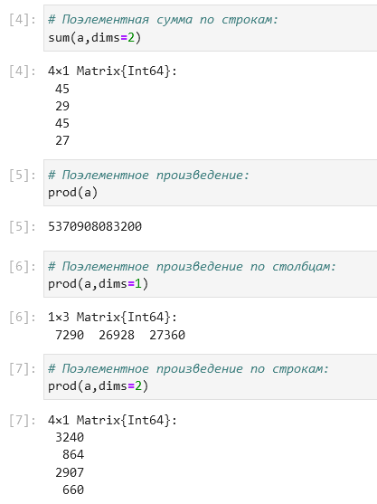
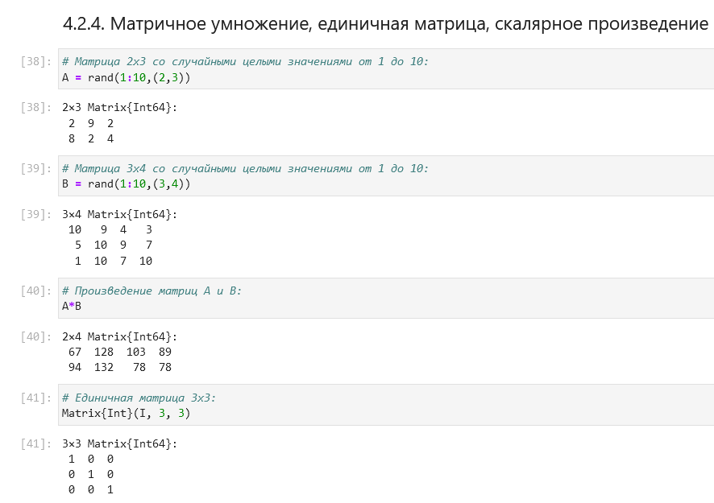
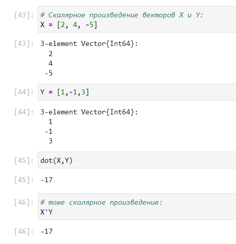
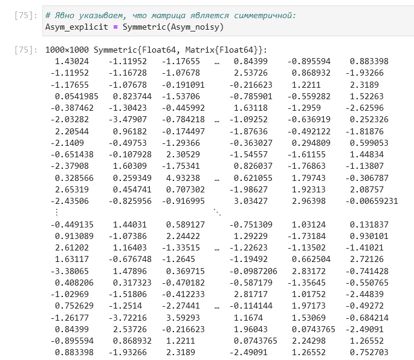

---
## Front matter
title: "Лабораторная работа №4"
subtitle: "Компьютерный практикум по статистическому анализу данных"
author: "Николаев Дмитрий Иванович"

## Generic otions
lang: ru-RU
toc-title: "Содержание"

## Bibliography
bibliography: bib/cite.bib
csl: pandoc/csl/gost-r-7-0-5-2008-numeric.csl

## Pdf output format
toc: true # Table of contents
toc-depth: 2
lof: true # List of figures
lot: true # List of tables
fontsize: 12pt
linestretch: 1.5
papersize: a4
documentclass: scrreprt
## I18n polyglossia
polyglossia-lang:
  name: russian
  options:
	- spelling=modern
	- babelshorthands=true
polyglossia-otherlangs:
  name: english
## I18n babel
babel-lang: russian
babel-otherlangs: english
## Fonts
mainfont: PT Serif
romanfont: PT Serif
sansfont: PT Sans
monofont: PT Mono
mainfontoptions: Ligatures=TeX
romanfontoptions: Ligatures=TeX
sansfontoptions: Ligatures=TeX,Scale=MatchLowercase
monofontoptions: Scale=MatchLowercase,Scale=0.9
## Biblatex
biblatex: true
biblio-style: "gost-numeric"
biblatexoptions:
  - parentracker=true
  - backend=biber
  - hyperref=auto
  - language=auto
  - autolang=other*
  - citestyle=gost-numeric
## Pandoc-crossref LaTeX customization
figureTitle: "Рис."
tableTitle: "Таблица"
listingTitle: "Листинг"
lofTitle: "Список иллюстраций"
lotTitle: "Список таблиц"
lolTitle: "Листинги"
## Misc options
indent: true
header-includes:
  - \usepackage{indentfirst}
  - \usepackage{float} # keep figures where there are in the text
  - \floatplacement{figure}{H} # keep figures where there are in the text
---

# Цель работы

Основной целью работы является изучение возможностей специализированных пакетов Julia для выполнения и оценки эффективности операций над объектами линейной
алгебры.

# Выполнение лабораторной работы  

Выполняем задания согласно указаниям [@lab4].

## Повторение примеров

Повторим примеры, представленные в лабораторной работе. Поэлементные операции над многомерными массивами ([@fig:001-@fig:003]); транспонирование, след, ранг, определитель и инверсия матрицы ([@fig:004,@fig:005]); вычисление нормы векторов и матриц, повороты, вращения ([@fig:006-@fig:008]); матричное умножение, единичная матрица, скалярное произведение и массивами ([@fig:009,@fig:010]); факторизация, специальные матричные структуры ([@fig:011-@fig:024]) и общая линейная алгебра ([@fig:025-@fig:026]).

{#fig:001 width=70%}

{#fig:002 width=70%}

{#fig:003 width=70%}

{#fig:004 width=70%}

{#fig:005 width=70%}

{#fig:006 width=70%}

{#fig:007 width=70%}

{#fig:008 width=70%}

{#fig:009 width=70%}

{#fig:010 width=70%}

{#fig:011 width=70%}

{#fig:012 width=70%}

{#fig:013 width=70%}

{#fig:014 width=70%}

{#fig:015 width=70%}

{#fig:016 width=70%}

{#fig:017 width=70%}

{#fig:018 width=70%}

{#fig:019 width=70%}

{#fig:020 width=70%}

{#fig:021 width=70%}

{#fig:022 width=70%}

{#fig:023 width=70%}

{#fig:024 width=70%}

{#fig:025 width=70%}

{#fig:026 width=70%}

## Самостоятельная работа

### Произведение векторов

Найдем скалярное и внешнее произведение векторов ([@fig:027]).

{#fig:027 width=70%}

### Системы линейных уравнений

Напишем функцию, решающую СЛАУ ([@fig:028]).

{#fig:028 width=70%}

1. Решаем СЛАУ с двумя неизвестными:

    1) Пункт а ([@fig:029])

        {#fig:029 width=70%}

    2) Пункты b, c и d ([@fig:030])

        {#fig:030 width=70%}

    3) Пункты e и f ([@fig:031])

        {#fig:031 width=70%}

2. Решаем СЛАУ с тремя неизвестными:

    1) Пункт а и b ([@fig:032])

        {#fig:032 width=70%}

    2) Пункт c ([@fig:033])

        {#fig:033 width=70%}

    3) Пункт d ([@fig:034])

        {#fig:034 width=70%}

### Операции с матрицами

1. Приведем матрицы к диагональному виду:

    1) Пункт а ([@fig:035,@fig:036])

        {#fig:035 width=70%}

        {#fig:036 width=70%}

    2) Пункт b ([@fig:037])

        {#fig:037 width=70%}

    3) Пункт c ([@fig:038,@fig:039])

        {#fig:038 width=70%}

        {#fig:039 width=70%}

2. Вычислим некоторые выражения:

    1) Пункт а ([@fig:040])

        {#fig:040 width=70%}

    2) Пункт b ([@fig:041,@fig:042])

        {#fig:041 width=70%}

        {#fig:042 width=70%}

    3) Пункт c ([@fig:043,@fig:044])

        {#fig:043 width=70%}

        {#fig:044 width=70%}

    4) Пункт d ([@fig:045,@fig:046])

        {#fig:045 width=70%}

        {#fig:046 width=70%}

3. Найдем собственные значения матрицы $A$ ([@fig:047]), создадим нижнедиагональную матрицу и диагональную матрицу из собственных значений матрицы $A$ ([@fig:048]), оценим эффективность этих операций, рассчитав время на выполнение операций ([@fig:049]).

    {#fig:047 width=70%}

    {#fig:048 width=70%}

    {#fig:049 width=70%}

### Линейные модели экономики

Напишем функции, которые будут необходимы для дальнейших заданий: создание диагональной матрицы из собственных значений некоторой матрицы, нахождение обратной матрицы к разности единичной и исходной матриц и решение СЛАУ линейной модели экономики ([@fig:050]).

{#fig:050 width=70%}

1. Проверим является ли матрица продуктивной (определение на первом скриншоте):

    1) Пункт а ([@fig:051,@fig:052])

        {#fig:051 width=70%}

        {#fig:052 width=70%}

    2) Пункт b ([@fig:053])

        {#fig:053 width=70%}

    3) Пункт c ([@fig:054])

        {#fig:054 width=70%}

2. Проверим матрицы на продуктивность с помощью критерия продуктивности. Напишем функцию для критерия продуктивности ([@fig:055]).

    {#fig:055 width=70%}

    1) Пункт a ([@fig:056])

        {#fig:056 width=70%}

    2) Пункт b ([@fig:057])

        {#fig:057 width=70%}

    3) Пункт c ([@fig:058])

        {#fig:058 width=70%}

3. Проверим матрицы на продуктивность с помощью спектрального критерия продуктивности. Напишем функцию для спектрального критерия продуктивности ([@fig:059]).

    {#fig:059 width=70%}

    1) Пункт a ([@fig:060])

        {#fig:060 width=70%}

    2) Пункт b ([@fig:061])

        {#fig:061 width=70%}

    3) Пункт c ([@fig:062])

        {#fig:062 width=70%}

    4) Пункт d ([@fig:063])

        {#fig:063 width=70%}

# Выводы

В ходе выполнения лабораторной работы я изучил специализированные пакеты Julia для выполнения и оценки эффективности операций над объектами линейной алгебры.

# Список литературы{.unnumbered}

::: {#refs}
:::
