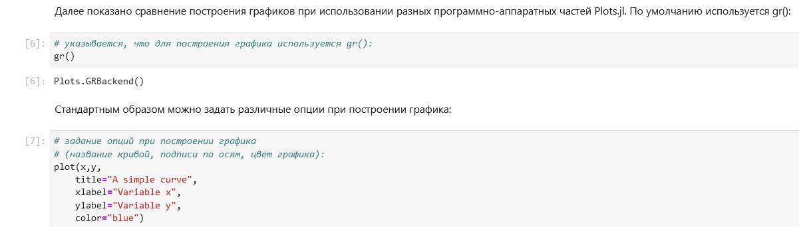
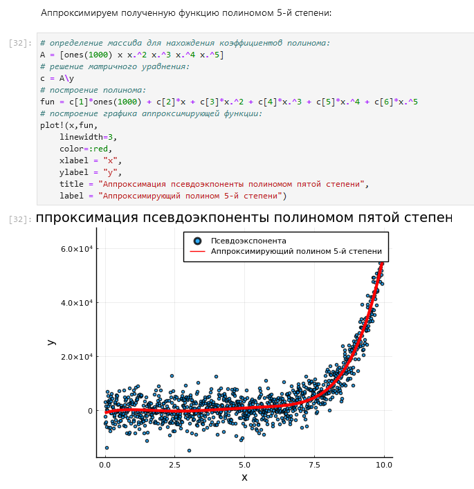
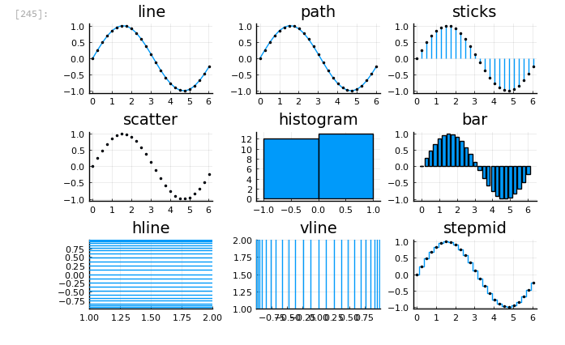

---
## Front matter
lang: ru-RU
title: Лабораторная работа №5
subtitle: Компьютерный практикум по статистическому анализу данных
author:
  - Николаев Д. И.
institute:
  - Российский университет дружбы народов, Москва, Россия
date: 26 ноября 2023

## i18n babel
babel-lang: russian
babel-otherlangs: english

## Formatting pdf
toc: false
toc-title: Содержание
slide_level: 2
aspectratio: 169
section-titles: true
theme: metropolis
header-includes:
 - \metroset{progressbar=frametitle,sectionpage=progressbar,numbering=fraction}
 - '\makeatletter'
 - '\beamer@ignorenonframefalse'
 - '\makeatother'
---

# Прагматика выполнения

- Получение навыков работы в Jupyter Notebook;
- Освоение особенностей языка Julia;
- Применение полученных знаний на практике в дальнейшем.

# Цели

Основная цель работы --- освоить синтаксис языка Julia для построения графиков

# Задачи

1. Используя Jupyter Lab, повторите примеры из раздела 5.2. При этом дополните графики
обозначениями осей координат, легендой с названиями траекторий, названиями
графиков и т.п.
2. Выполните задания для самостоятельной работы (раздел 5.4)

# Повторение примеров

## Основные пакеты для работы с графиками в Julia (1)

{#fig:001 width=70%}

## Основные пакеты для работы с графиками в Julia (2)

{#fig:002 width=70%}

## Основные пакеты для работы с графиками в Julia (3)

{#fig:003 width=70%}

## Основные пакеты для работы с графиками в Julia (4)

{#fig:004 width=70%}

## Основные пакеты для работы с графиками в Julia (5)

{#fig:005 width=70%}

## Основные пакеты для работы с графиками в Julia (6)

{#fig:006 width=70%}

## Основные пакеты для работы с графиками в Julia (7)

{#fig:007 width=70%}

## Основные пакеты для работы с графиками в Julia (8)

{#fig:008 width=70%}

## Опции при построении графика (1)

{#fig:009 width=70%}

## Опции при построении графика (2)

{#fig:010 width=70%}

## Опции при построении графика (3)

{#fig:011 width=70%}

## Опции при построении графика (4)

{#fig:012 width=70%}

## Опции при построении графика (5)

{#fig:013 width=70%}

## Опции при построении графика (6)

{#fig:014 width=70%}

## Опции при построении графика (7)

{#fig:015 width=70%}

## Опции при построении графика (8)

{#fig:016 width=70%}

## Простой точечный график

{#fig:017 width=70%}

## Точечный график с кодированием значения размером точки

{#fig:018 width=70%}

## 3-мерный точечный график с кодированием значения размером точки

{#fig:019 width=70%}

## Аппроксимация данных (1)

{#fig:020 width=70%}

## Аппроксимация данных (2)

{#fig:021 width=70%}

## Две оси ординат (1)

{#fig:022 width=70%}

## Две оси ординат (2)

{#fig:023 width=70%}

## Полярные координаты

{#fig:024 width=70%}

## Параметрический график кривой на плоскости

{#fig:025 width=70%}

## Параметрический график кривой в пространстве

{#fig:026 width=70%}

## График поверхности (1)

{#fig:027 width=70%}

## График поверхности (2)

{#fig:028 width=70%}

## График поверхности (3)

{#fig:029 width=70%}

## График поверхности (4)

{#fig:030 width=70%}

## График поверхности (5)

{#fig:031 width=70%}

## Линии уровня (1)

{#fig:032 width=70%}

## Линии уровня (2)

{#fig:033 width=70%}

## Линии уровня (3)

{#fig:034 width=70%}

## Векторные поля (1)

{#fig:035 width=70%}

## Векторные поля (2)

{#fig:036 width=70%}

## Векторные поля (3)

{#fig:037 width=70%}

## Векторные поля (4)

{#fig:038 width=70%}

## Gif-анимация (1)

{#fig:039 width=70%}

## Gif-анимация (2)

{#fig:040 width=70%}

## Gif-анимация (3)

{#fig:041 width=70%}

## Гипоциклоида (1)

{#fig:042 width=70%}

## Гипоциклоида (2)

{#fig:043 width=70%}

## Гипоциклоида (3)

{#fig:044 width=70%}

## Гипоциклоида (4)

{#fig:045 width=70%}

## Гипоциклоида (5)

{#fig:046 width=70%}

## Гипоциклоида (6)

{#fig:047 width=70%}

## Гипоциклоида (7)

{#fig:048 width=70%}

## Гипоциклоида (8)

{#fig:049 width=70%}

## Гипоциклоида (9)

{#fig:050 width=70%}

## Гипоциклоида (10)

{#fig:051 width=70%}

## Гипоциклоида (11)

{#fig:052 width=70%}

## Гипоциклоида (12)

{#fig:053 width=70%}

## Errorbars (1)

{#fig:054 width=70%}

## Errorbars (2)

{#fig:055 width=70%}

## Errorbars (3)

{#fig:056 width=70%}

## Errorbars (4)

{#fig:057 width=70%}

## Errorbars (5)

{#fig:058 width=70%}

## Errorbars (6)

{#fig:059 width=70%}

## Errorbars (7)

{#fig:060 width=70%}

## Errorbars (8)

{#fig:061 width=70%}

## Использование пакета Distributions (1)

{#fig:062 width=70%}

## Использование пакета Distributions (2)

{#fig:063 width=70%}

## Использование пакета Distributions (3)

{#fig:064 width=70%}

## Использование пакета Distributions (4)

{#fig:065 width=70%}

## Использование пакета Distributions (5)

{#fig:066 width=70%}

## Подграфики (1)

{#fig:067 width=70%}

## Подграфики (2)

{#fig:068 width=70%}

## Подграфики (3)

{#fig:069 width=70%}

## Подграфики (4)

{#fig:070 width=70%}

## Подграфики (5)

{#fig:071 width=70%}

## Подграфики (6)

{#fig:072 width=70%}

## Подграфики (7)

{#fig:073 width=70%}

# Самостоятельное задание

## Задание 5.4.1. Различные типы графиков (1)

{#fig:074 width=70%}

## Задание 5.4.1. Различные типы графиков (2)

{#fig:075 width=70%}

## Задание 5.4.2. Различные типы оформления графиков (1)

{#fig:076 width=70%}

## Задание 5.4.2. Различные типы оформления графиков (2)

{#fig:077 width=70%}

## Задание 5.4.3 (1)

{#fig:078 width=70%}

## Задание 5.4.3 (2)

{#fig:079 width=70%}

## Задание 5.4.4 (1)

{#fig:080 width=70%}

## Задание 5.4.4 (2)

{#fig:081 width=70%}

## Задание 5.4.5 (1)

{#fig:082 width=70%}

## Задание 5.4.5 (2)

{#fig:083 width=70%}

## Задание 5.4.5 (3)

{#fig:084 width=70%}

## Задание 5.4.6 (1)

{#fig:085 width=70%}

## Задание 5.4.6 (2)

{#fig:086 width=70%}

## Задание 5.4.7. Двумерный точечный график случайных данных

{#fig:087 width=70%}

## Задание 5.4.8. Трехмерный точечный график случайных данных

{#fig:088 width=70%}

## Задание 5.4.9. Анимация синусоиды (1)

{#fig:089 width=70%}

## Задание 5.4.9. Анимация синусоиды (2)

{#fig:090 width=70%}

## Задание 5.4.10. Формула гипоциклоиды

{#fig:091 width=70%}

## Задание 5.4.10. Функция анимации гипоциклоиды

{#fig:092 width=70%}

## Задание 5.4.10. Гипоциклоида, где $k = 4$ (1)

{#fig:093 width=70%}

## Задание 5.4.10. Гипоциклоида, где $k = 4$ (2)

{#fig:094 width=70%}

## Задание 5.4.10. Анимация гипоциклоиды, где $k = 4$

{#gif:004 width=70%}

## Задание 5.4.10. Гипоциклоида, где $k = 2$ (1)

{#fig:095 width=70%}

## Задание 5.4.10. Гипоциклоида, где $k = 2$ (2)

{#fig:096 width=70%}

## Задание 5.4.10. Анимация гипоциклоиды, где $k = 2$

{#gif:005 width=70%}

## Задание 5.4.10. Гипоциклоида, где $k = \frac{3}{2}$ (1)

{#fig:097 width=70%}

## Задание 5.4.10. Гипоциклоида, где $k = \frac{3}{2}$ (2)

{#fig:098 width=70%}

## Задание 5.4.10. Анимация гипоциклоиды, где $k = \frac{3}{2}$

{#gif:006 width=70%}

## Задание 5.4.10. Гипоциклоида, где $k = \frac{5}{3}$ (1)

{#fig:099 width=70%}

## Задание 5.4.10. Гипоциклоида, где $k = \frac{5}{3}$ (2)

{#fig:100 width=70%}

## Задание 5.4.10. Анимация гипоциклоиды, где $k = \frac{5}{3}$

{#gif:007 width=70%}

## Задание 5.4.11. Формула эпициклоиды

{#fig:101 width=70%}

## Задание 5.4.11. Функция анимации эпициклоиды

{#fig:102 width=70%}

## Задание 5.4.11. Эпициклоида, где $k = 4$ (1)

{#fig:103 width=70%}

## Задание 5.4.11. Эпициклоида, где $k = 4$ (2)

{#fig:104 width=70%}

## Задание 5.4.11. Анимация эпициклоиды, где $k = 4$

{#gif:008 width=70%}

## Задание 5.4.11. Эпициклоида, где $k = 2$ (1)

{#fig:105 width=70%}

## Задание 5.4.11. Эпициклоида, где $k = 2$ (2)

{#fig:106 width=70%}

## Задание 5.4.11. Анимация эпициклоиды, где $k = 2$

{#gif:009 width=70%}

## Задание 5.4.11. Эпициклоида, где $k = \frac{3}{2}$ (1)

{#fig:107 width=70%}

## Задание 5.4.11. Эпициклоида, где $k = \frac{3}{2}$ (2)

{#fig:108 width=70%}

## Задание 5.4.11. Анимация эпициклоиды, где $k = \frac{3}{2}$

{#gif:010 width=70%}

## Задание 5.4.11. Эпициклоида, где $k = \frac{5}{3}$ (1)

{#fig:109 width=70%}

## Задание 5.4.11. Эпициклоида, где $k = \frac{5}{3}$ (2)

{#fig:110 width=70%}

## Задание 5.4.11. Анимация эпициклоиды, где $k = \frac{5}{3}$

{#gif:011 width=70%}

# Результаты

В ходе работы я освоил возможности Julia по построению графиков
