---
## Front matter
title: "Лабораторная работа №5"
subtitle: "Компьютерный практикум по статистическому анализу данных"
author: "Николаев Дмитрий Иванович"

## Generic otions
lang: ru-RU
toc-title: "Содержание"

## Bibliography
bibliography: bib/cite.bib
csl: pandoc/csl/gost-r-7-0-5-2008-numeric.csl

## Pdf output format
toc: true # Table of contents
toc-depth: 2
lof: true # List of figures
lot: true # List of tables
fontsize: 12pt
linestretch: 1.5
papersize: a4
documentclass: scrreprt
## I18n polyglossia
polyglossia-lang:
  name: russian
  options:
	- spelling=modern
	- babelshorthands=true
polyglossia-otherlangs:
  name: english
## I18n babel
babel-lang: russian
babel-otherlangs: english
## Fonts
mainfont: PT Serif
romanfont: PT Serif
sansfont: PT Sans
monofont: PT Mono
mainfontoptions: Ligatures=TeX
romanfontoptions: Ligatures=TeX
sansfontoptions: Ligatures=TeX,Scale=MatchLowercase
monofontoptions: Scale=MatchLowercase,Scale=0.9
## Biblatex
biblatex: true
biblio-style: "gost-numeric"
biblatexoptions:
  - parentracker=true
  - backend=biber
  - hyperref=auto
  - language=auto
  - autolang=other*
  - citestyle=gost-numeric
## Pandoc-crossref LaTeX customization
figureTitle: "Рис."
tableTitle: "Таблица"
listingTitle: "Листинг"
lofTitle: "Список иллюстраций"
lotTitle: "Список таблиц"
lolTitle: "Листинги"
## Misc options
indent: true
header-includes:
  - \usepackage{indentfirst}
  - \usepackage{float} # keep figures where there are in the text
  - \floatplacement{figure}{H} # keep figures where there are in the text
---

# Цель работы

Основная цель работы --- освоить синтаксис языка Julia для построения графиков.

# Выполнение лабораторной работы

Выполняем задания согласно указаниям [@lab5].

## Повторение примеров

Повторим примеры, представленные в лабораторной работе ([@lab5]).

### Основные пакеты для работы с графиками в Julia

Подключим пакеты и построим простой график ([@fig:001-@fig:003]).

### Опции при построении графика

Построим график и рассмотрим некоторые опции при построении ([@fig:001-@fig:003]).

### Точечный график

#### Простой точечный график

Построим простой точечный график ([@fig:001-@fig:003]).

#### Точечный график с кодированием значения размером точки

Построим точечный график с разными опциями для точек ([@fig:001-@fig:003]).

#### 3-мерный точечный график с кодированием значения размером точки

Построим трехмерный точечный график с разным размером точек ([@fig:001-@fig:003]).

### Аппроксимация данных

Аппроксимация --- научный метод, состоящий в замене объектов их более простыми
аналогами, сходными по своим свойствам.

Пусть на некотором отрезке в точках $x_0, x_1, x_2, \dots, 𝑥_𝑁$ известны значения некоторой функции $f(𝑥)$, а именно $y_0, y_1, y_2, \dots, y_𝑁$. Требуется определить параметры $a_i$ многочлена вида $F (x) = a_0 + a_1𝑥 + a_2x^2 + \dots + a_𝑘x^k$, где $k < N$ такое, что сумма квадратов
отклонений значений $y$ от значений функции $F (y)$ в заданных точках $x$ минимальна, т.е.
$$
S = \sum_{i=0}^{N} (y_i - F(x_i, a_0, a_1, \dots, a_k))^2 \rightarrow \text{min}.
$$

Геометрически это означит, что нужно найти кривую $y = F (x)$, полином которой
проходит как можно ближе к каждой из заданных точек.

Такая задача может быть решена, если решить систему уравнений вида: $A \overline{x} = \overline{y}$,
где $A$ --- матрица коэффициентов многочлена $F (𝑥)$, $\overline{x}$, $\overline{y}$ --- вектора соответствующих
значений.

Зададим некоторую функцию, похожую на экспоненту и аппроксимируем ее ([@fig:001-@fig:003]).

### Две оси ординат

Построим графики с двумя осями ординат ([@fig:001-@fig:003]).

### Полярные координаты

Построим график в полярных координатах ([@fig:001-@fig:003]).

### Параметрический график

При параметрическом представлении графика некоторой функции координаты на
графике задаются как функции от некоторого набора свободных параметров. В случае
одного параметра получим параметрическое уравнение кривой. Выражая координаты
точек поверхности через два свободных параметра, получим параметрическое задание
поверхности.

#### Параметрический график кривой на плоскости

Построим параметрически заданную кривую на плоскости ([@fig:001-@fig:003]).

#### Параметрический график кривой в пространстве

Построим параметрически заданную кривую в пространстве ([@fig:001-@fig:003]).

### График поверхности

Построим график поверхности ([@fig:001-@fig:003]).

### Линии уровня

Линией уровня некоторой функции от двух переменных называется множество точек
на координатной плоскости, в которых функция принимает одинаковые значения. Линий
уровня бесконечно много, и через каждую точку области определения можно провести
линию уровня.

С помощью линий уровня можно определить наибольшее и наименьшее значение
исходной функции от двух переменных. Каждая из этих линий соответствует определенному значению высоты.

Поверхности уровня представляют собой непересекающиеся пространственные поверхности

Построим поверхность и ее линии уровня ([@fig:001-@fig:003]).

### Векторные поля

Если каждой точке некоторой области пространства поставлен в соответствие вектор
с началом в данной точке, то говорят, что в этой области задано векторное поле.

Векторные поля задают векторными функциями.

Построим график некоторой функции вместе с ее линиями уровня и построим для этой функции векторное поле ([@fig:001-@fig:003]).

### Анимация

Технически анимированное изображение представляет собой несколько наложенных
изображений (или построенных в разных точках графиках) в одном файле.

#### Gif-анимация

Анимируем график поверхности ([@fig:001-@fig:003]).

#### Гипоциклоида

Гипоциклоида --- плоская кривая, образуемая точкой окружности, катящейся по внутренней стороне другой окружности без скольжения:
$$
\begin{cases}
x = r(k - 1) \Big(\cos t + \frac{\cos ((k-1)t)}{k-1}\Big), \\
y = r(k - 1) \Big(\sin t - \frac{\sin ((k-1)t)}{k-1}\Big),
\end{cases}
$$
где $k = \frac𝑅𝑟$, $R$ --- радиус неподвижной окружности, $r$ --- радиус катящейся окружности.
Модуль величины $k$ определяет форму гипоциклоиды.

Построим гипоциклоиду и сделаем анимацию движения катящейся окружности ([@fig:001-@fig:003]).

### Errorbars

Построим графики погрешностей измерения ([@fig:001-@fig:003]).

### Использование пакета Distributions

Построим несколько гистограмм с помощью пакета Distributions ([@fig:001-@fig:003]).

### Подграфики

Построим несколько графиков, состоящих из нескольких подграфиков ([@fig:001-@fig:003]).

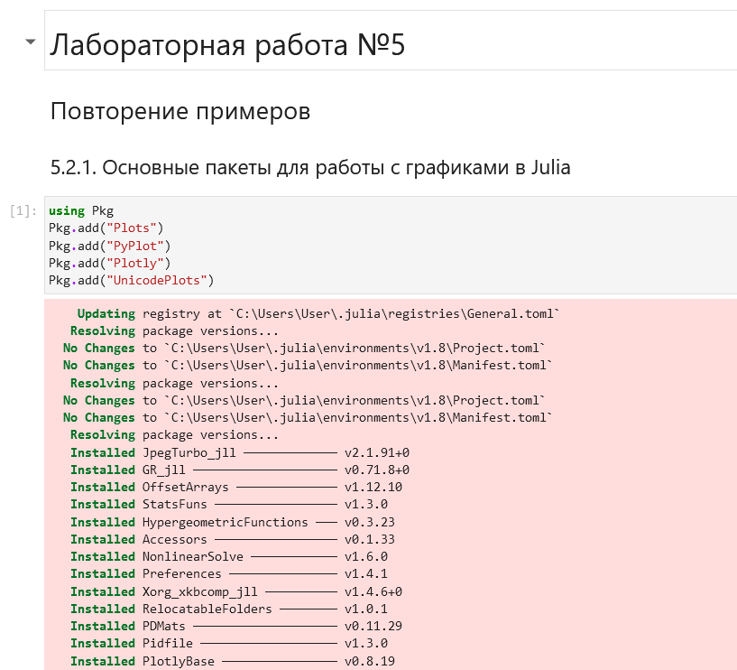{#fig:001 width=70%}

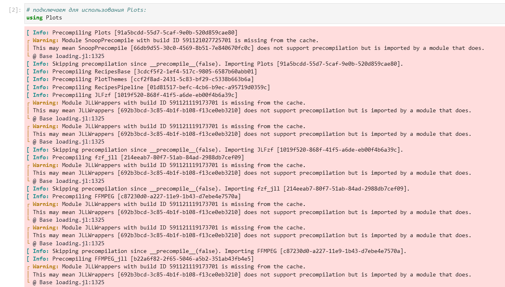{#fig:002 width=70%}

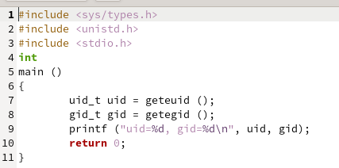{#fig:003 width=70%}

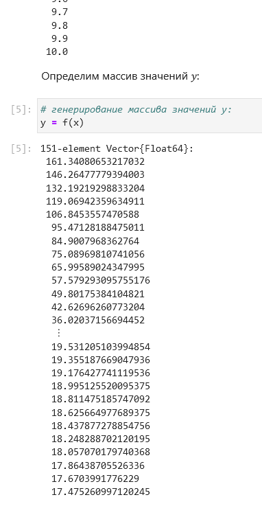{#fig:004 width=70%}

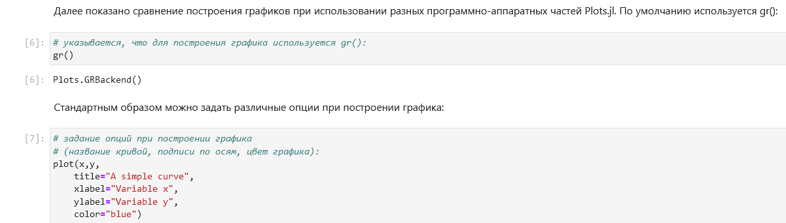{#fig:005 width=70%}

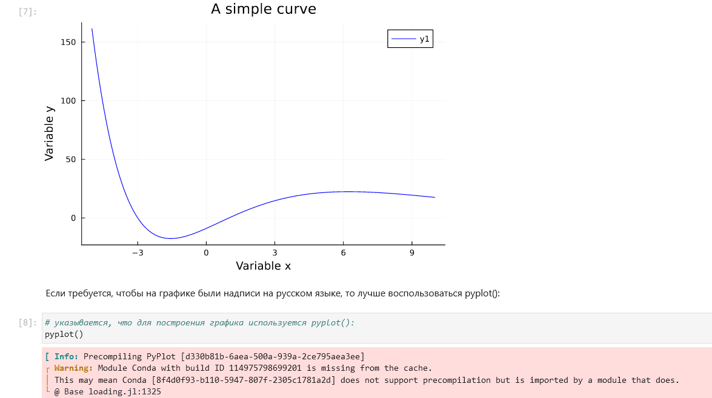{#fig:006 width=70%}

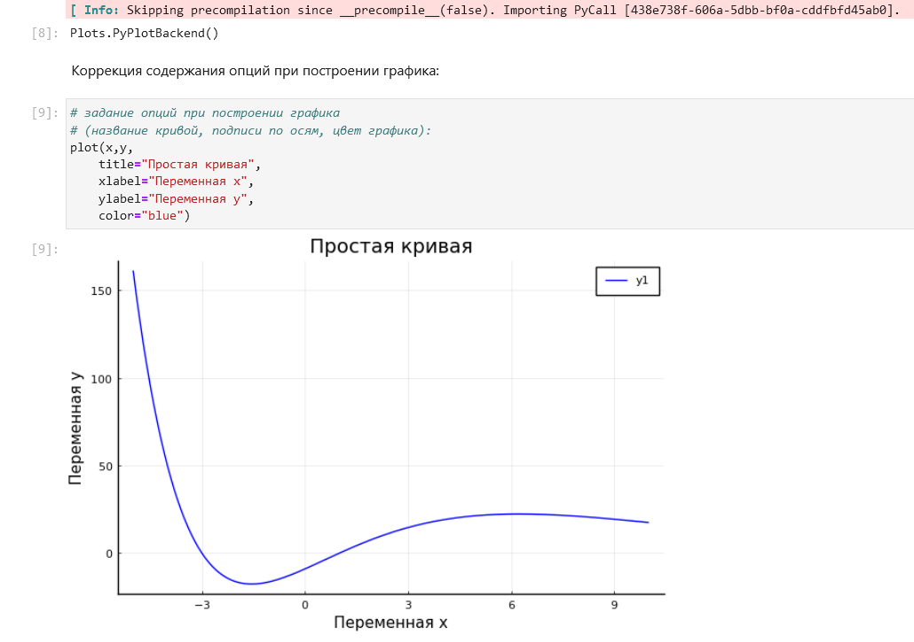{#fig:007 width=70%}

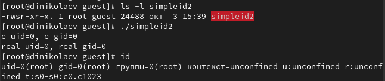{#fig:008 width=70%}

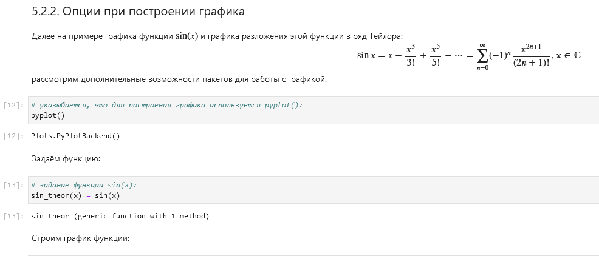{#fig:009 width=70%}

{#fig:010 width=70%}

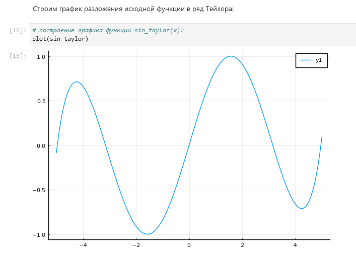{#fig:011 width=70%}

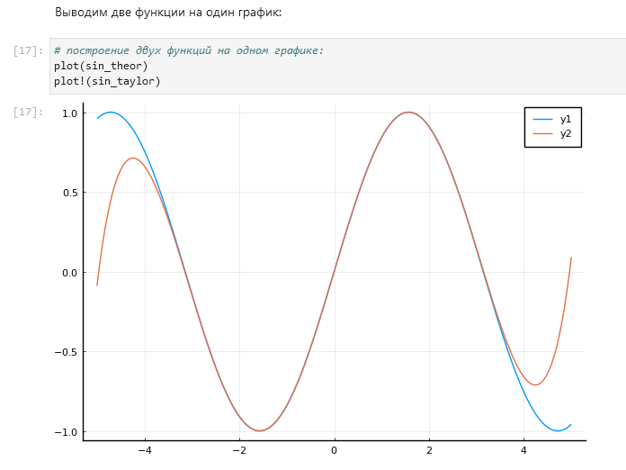{#fig:012 width=70%}

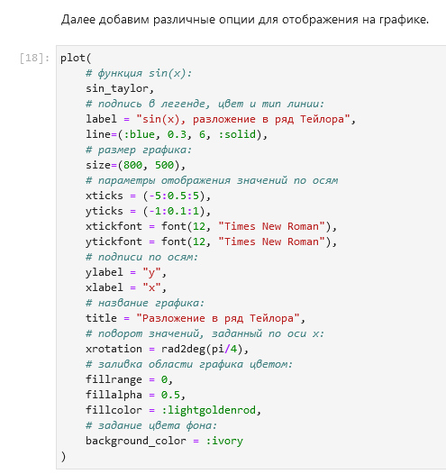{#fig:013 width=70%}

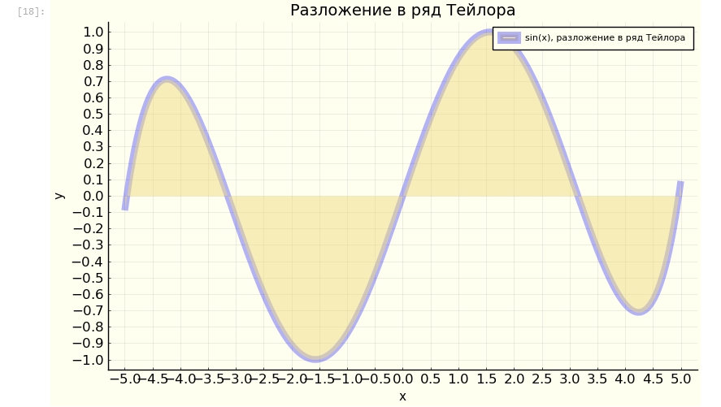{#fig:014 width=70%}

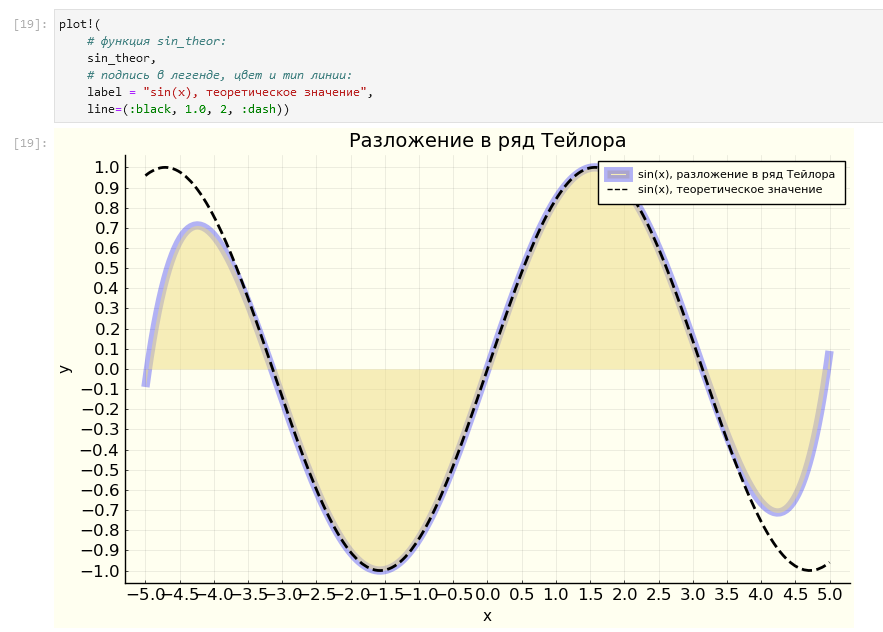{#fig:015 width=70%}

{#fig:016 width=70%}

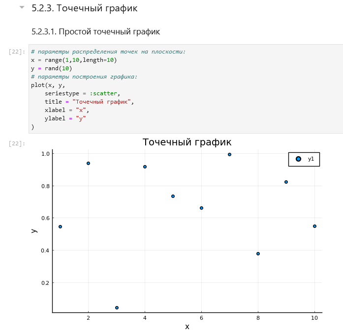{#fig:017 width=70%}

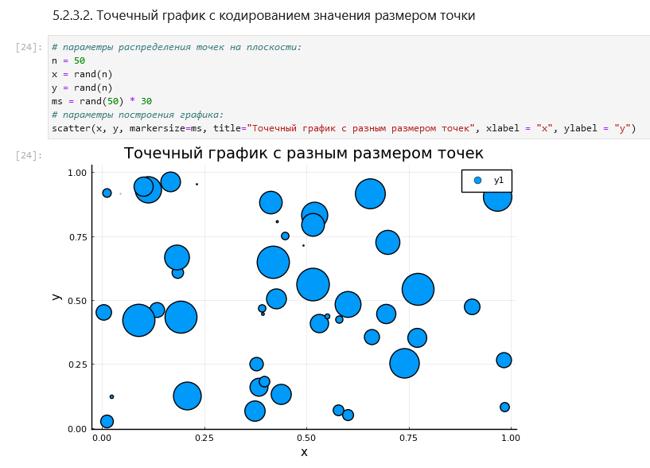{#fig:018 width=70%}

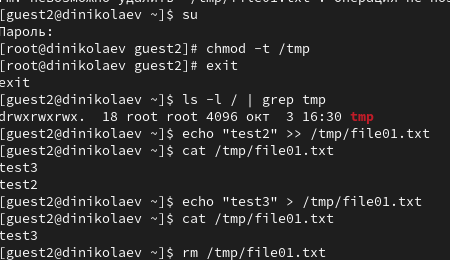{#fig:019 width=70%}

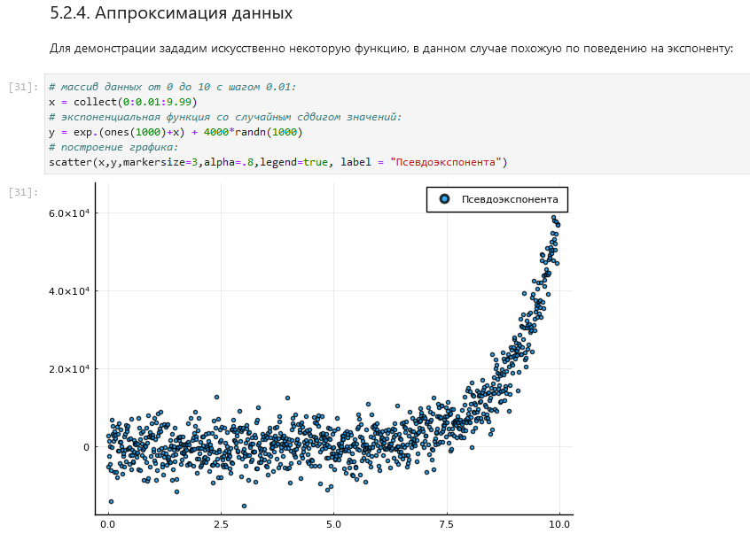{#fig:020 width=70%}

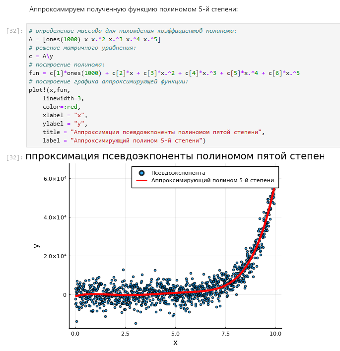{#fig:021 width=70%}

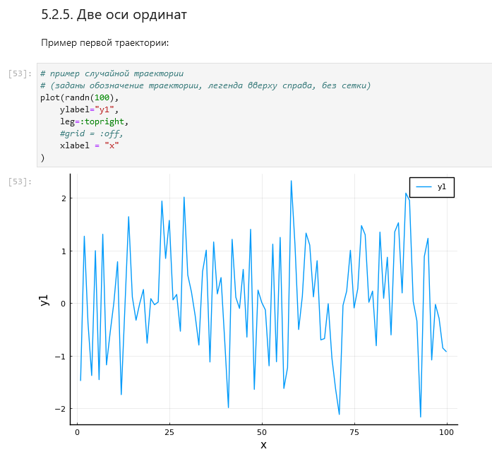{#fig:022 width=70%}

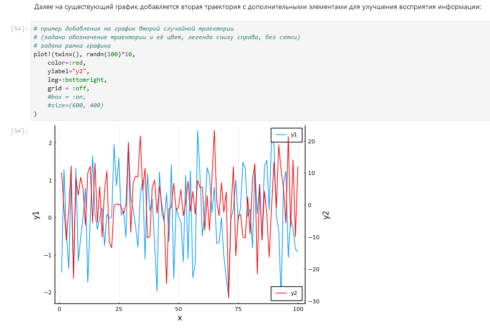{#fig:023 width=70%}

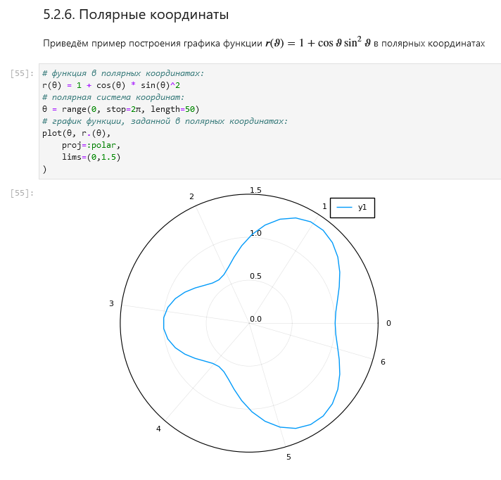{#fig:024 width=70%}

{#fig:025 width=70%}

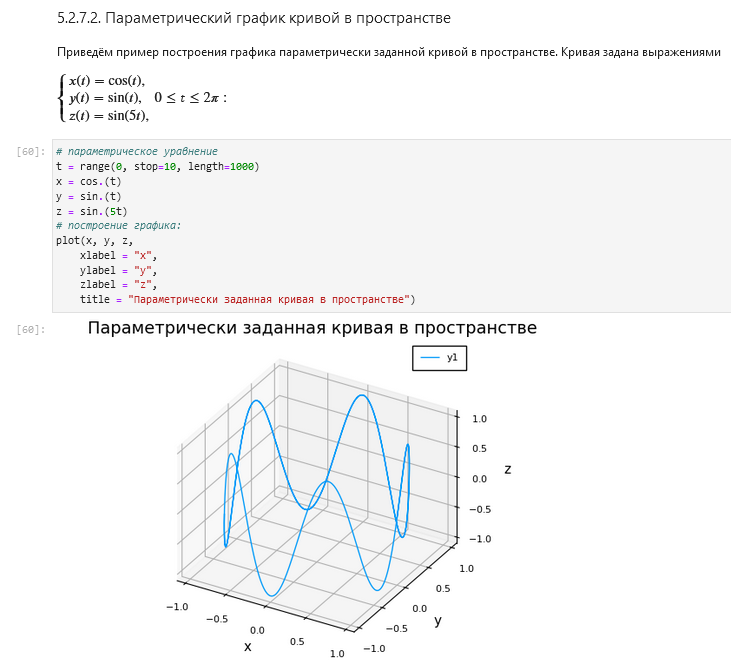{#fig:026 width=70%}

## Самостоятельная работа

1. Построим график $y = \sin(x)$ всеми (почти) возможными способами и отобразим их в одном окне

2. Построим график $y = \sin(x)$ всеми возможными типами оформления графиков и отобразим их в одном окне

3. Построим график $y(x) = \pi x^2 \ln(x)$ с различными параметрами (точное задание на скриншотах ).

4. Зададим вектор $x = (−2, −1, 0, 1, 2)$ и в одном графическом окне отобразим значение функции $y(x) = x^3 − 3x$ различными способами (точное задание на скриншотах )

5. Зададим вектор $x = (3, 3.1, 3.2, \dots, 6)$ и построим графики функций $y_1(x) = \pi x$ и $y_2(x) = e^x \cos(x)$ двумя способами (точное задание на скриншотах )

6. Построим график некоторых экспериментальных данных, учитывая ошибку измерения ().

7. Построим двумерный точечный график случайных данных ().

8. Построим трехмерный точечный график случайных данных ().

9. Создадим анимацию синусоиды ().

10. Построим анимированную гипоциклоиду для 2 целых значений модуля $k$ и 2 рациональных значений модуля $k$ ().

11. Построим анимированную эпициклоиду для 2 целых значений модуля $k$ и 2 рациональных значений модуля $k$ ().

    Эпициклоида - плоская кривая, образуемая точкой окружности, катящейся по внешней стороне другой окружности без скольжения:
    $$
    \begin{cases}
    x = r(k + 1) \Big(\cos t - \frac{\cos ((k+1)t)}{k+1}\Big), \\
    y = r(k + 1) \Big(\sin t - \frac{\sin ((k+1)t)}{k+1}\Big),
    \end{cases}
    $$
    где $k = \frac{𝑅}{𝑟}$, $R$ - радиус неподвижной окружности, $r$ - радиус катящейся окружности.
    Модуль величины $k$ определяет форму эпициклоиды.

# Выводы

В ходе выполнения лабораторной работы я освоил возможности Julia по построению графиков.

# Список литературы{.unnumbered}

::: {#refs}
:::
