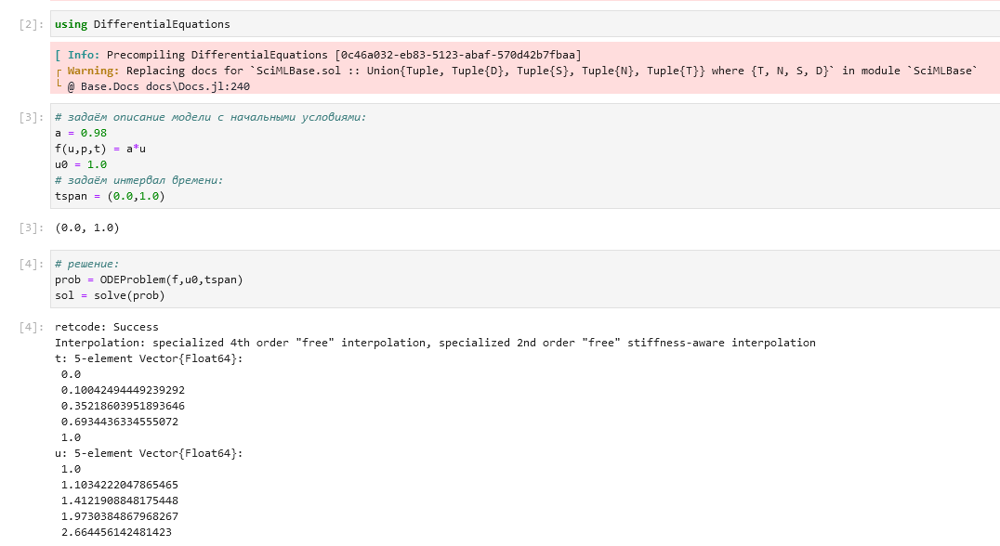
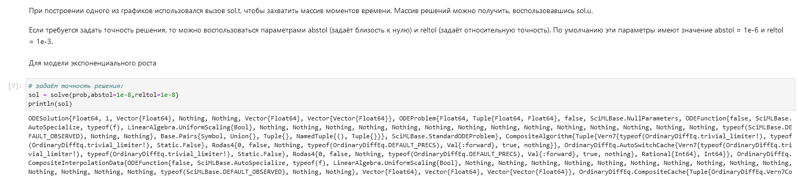
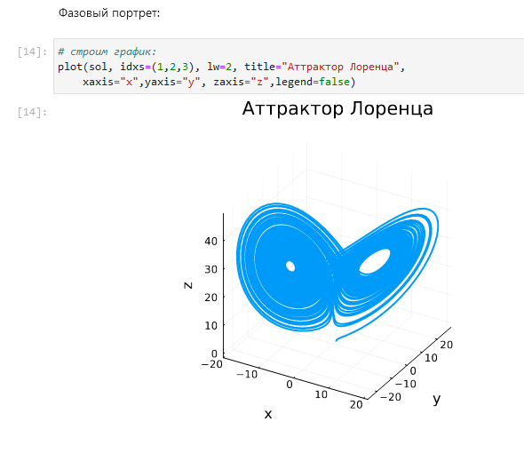
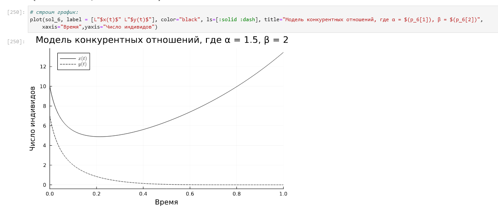
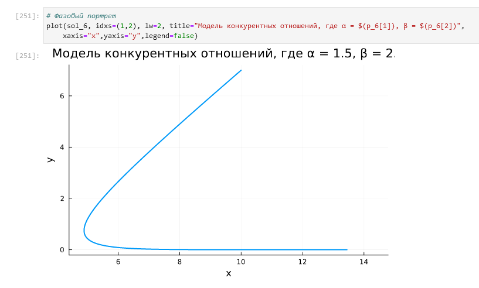
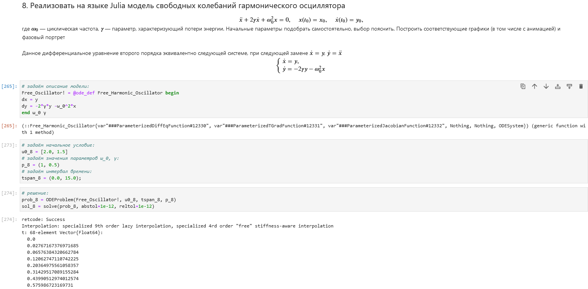

---
## Front matter
lang: ru-RU
title: Лабораторная работа №6
subtitle: Компьютерный практикум по статистическому анализу данных
author:
  - Николаев Д. И.
institute:
  - Российский университет дружбы народов, Москва, Россия
date: 29 ноября 2023

## i18n babel
babel-lang: russian
babel-otherlangs: english

## Formatting pdf
toc: false
toc-title: Содержание
slide_level: 2
aspectratio: 169
section-titles: true
theme: metropolis
header-includes:
 - \metroset{progressbar=frametitle,sectionpage=progressbar,numbering=fraction}
 - '\makeatletter'
 - '\beamer@ignorenonframefalse'
 - '\makeatother'
---

# Прагматика выполнения

- Получение навыков работы в Jupyter Notebook;
- Освоение особенностей языка Julia;
- Применение полученных знаний на практике в дальнейшем.

# Цели

Основной целью работы является освоение специализированных пакетов для решения
задач в непрерывном и дискретном времени

# Задачи

1. Используя Jupyter Lab, повторите примеры из раздела 6.2.
2. Выполните задания для самостоятельной работы (раздел 6.4).

# Повторение примеров

## Модель экспоненциального роста (1)

{#fig:001 width=70%}

## Модель экспоненциального роста (2)

{#fig:002 width=70%}

## Модель экспоненциального роста (3)

{#fig:003 width=70%}

## Модель экспоненциального роста (4)

{#fig:004 width=70%}

## Модель экспоненциального роста (5)

{#fig:005 width=70%}

## Система Лоренца (1)

{#fig:006 width=70%}

## Система Лоренца (2)

{#fig:007 width=70%}

## Система Лоренца (3)

{#fig:008 width=70%}

## Система Лоренца (4)

{#fig:009 width=70%}

## Система Лоренца (5)

{#fig:010 width=70%}

## Модель Лотки–Вольтерры (1)

{#fig:011 width=70%}

## Модель Лотки–Вольтерры (2)

{#fig:012 width=70%}

## Модель Лотки–Вольтерры (3)

{#fig:013 width=70%}

## Модель Лотки–Вольтерры (4)

{#fig:014 width=70%}

## Модель Лотки–Вольтерры (5)

{#fig:015 width=70%}

# Самостоятельное задание

## Задание 6.4.1. Модель Мальтуса (1)

{#fig:016 width=70%}

## Задание 6.4.1. Модель Мальтуса (2)

{#fig:017 width=70%}

## Задание 6.4.1. Модель Мальтуса (3)

{#fig:018 width=70%}

## Задание 6.4.1. Модель Мальтуса (4)

{#fig:019 width=70%}

## Задание 6.4.2. Логистическая модель (1)

{#fig:020 width=70%}

## Задание 6.4.2. Логистическая модель (2)

{#fig:021 width=70%}

## Задание 6.4.2. Логистическая модель (3)

{#fig:022 width=70%}

## Задание 6.4.2. Логистическая модель (4)

{#fig:023 width=70%}

## Задание 6.4.3. SIR-модель (1)

{#fig:024 width=70%}

## Задание 6.4.3. SIR-модель (2)

{#fig:025 width=70%}

## Задание 6.4.3. SIR-модель (3)

{#fig:026 width=70%}

## Задание 6.4.3. SIR-модель (4)

{#fig:027 width=70%}

## Задание 6.4.4. SEIR-модель (Susceptible-Exposed-Infected-Removed) (1)

{#fig:028 width=70%}

## Задание 6.4.4. SEIR-модель (Susceptible-Exposed-Infected-Removed) (2)

{#fig:029 width=70%}

## Задание 6.4.4. SEIR-модель (Susceptible-Exposed-Infected-Removed) (3)

{#fig:030 width=70%}

## Задание 6.4.4. SEIR-модель (Susceptible-Exposed-Infected-Removed) (4)

{#fig:031 width=70%}

## Задание 6.4.5. Дискретная модель Лотки-Вольтерры (1)

{#fig:032 width=70%}

## Задание 6.4.5. Дискретная модель Лотки-Вольтерры (2)

{#fig:033 width=70%}

## Задание 6.4.5. Дискретная модель Лотки-Вольтерры (3)

{#fig:034 width=70%}

## Задание 6.4.5. Дискретная модель Лотки-Вольтерры (4)

{#fig:035 width=70%}

## Задание 6.4.5. Дискретная модель Лотки-Вольтерры (5)

{#fig:036 width=70%}

## Задание 6.4.6. Модель отбора на основе конкурентных отношений (1)

{#fig:037 width=70%}

## Задание 6.4.6. Модель отбора на основе конкурентных отношений (2)

{#fig:038 width=70%}

## Задание 6.4.6. Модель отбора на основе конкурентных отношений (3)

{#fig:039 width=70%}

## Задание 6.4.6. Модель отбора на основе конкурентных отношений (4)

{#fig:040 width=70%}

## Задание 6.4.6. Модель отбора на основе конкурентных отношений (5)

{#fig:041 width=70%}

## Задание 6.4.7. Модель консервативного гармонического осциллятора (1)

{#fig:042 width=70%}

## Задание 6.4.7. Модель консервативного гармонического осциллятора (2)

{#fig:043 width=70%}

## Задание 6.4.7. Модель консервативного гармонического осциллятора (3)

{#fig:044 width=70%}

## Задание 6.4.7. Модель консервативного гармонического осциллятора (4)

{#fig:045 width=70%}

## Задание 6.4.7. Модель консервативного гармонического осциллятора (5)

{#fig:046 width=70%}

## Задание 6.4.8. Модель свободных колебаний гармонического осциллятора (1)

{#fig:047 width=70%}

## Задание 6.4.8. Модель свободных колебаний гармонического осциллятора (2)

{#fig:048 width=70%}

## Задание 6.4.8. Модель свободных колебаний гармонического осциллятора (3)

{#fig:049 width=70%}

## Задание 6.4.8. Модель свободных колебаний гармонического осциллятора (4)

{#fig:050 width=70%}

## Задание 6.4.8. Модель свободных колебаний гармонического осциллятора (5)

{#fig:051 width=70%}

# Результаты

В ходе работы я освоил специализированные пакеты Julia для решения задач в непрерывном и дискретном времени
