---
## Front matter
title: "Лабораторная работа №7"
subtitle: "Компьютерный практикум по статистическому анализу данных"
author: "Николаев Дмитрий Иванович"

## Generic otions
lang: ru-RU
toc-title: "Содержание"

## Bibliography
bibliography: bib/cite.bib
csl: pandoc/csl/gost-r-7-0-5-2008-numeric.csl

## Pdf output format
toc: true # Table of contents
toc-depth: 2
lof: true # List of figures
lot: true # List of tables
fontsize: 12pt
linestretch: 1.5
papersize: a4
documentclass: scrreprt
## I18n polyglossia
polyglossia-lang:
  name: russian
  options:
	- spelling=modern
	- babelshorthands=true
polyglossia-otherlangs:
  name: english
## I18n babel
babel-lang: russian
babel-otherlangs: english
## Fonts
mainfont: PT Serif
romanfont: PT Serif
sansfont: PT Sans
monofont: PT Mono
mainfontoptions: Ligatures=TeX
romanfontoptions: Ligatures=TeX
sansfontoptions: Ligatures=TeX,Scale=MatchLowercase
monofontoptions: Scale=MatchLowercase,Scale=0.9
## Biblatex
biblatex: true
biblio-style: "gost-numeric"
biblatexoptions:
  - parentracker=true
  - backend=biber
  - hyperref=auto
  - language=auto
  - autolang=other*
  - citestyle=gost-numeric
## Pandoc-crossref LaTeX customization
figureTitle: "Рис."
tableTitle: "Таблица"
listingTitle: "Листинг"
lofTitle: "Список иллюстраций"
lotTitle: "Список таблиц"
lolTitle: "Листинги"
## Misc options
indent: true
header-includes:
  - \usepackage{indentfirst}
  - \usepackage{float} # keep figures where there are in the text
  - \floatplacement{figure}{H} # keep figures where there are in the text
---

# Цель работы

Основной целью работы является освоение специализированных пакетов Julia для обработки
данных.

# Выполнение лабораторной работы

## Повторение примеров

Повторим примеры, представленные в лабораторной работе ([@lab7]).

### Julia для науки о данных

В Julia для обработки данных используются наработки из других языков программирования, в частности, из R и Python

#### Считывание данных

Перед тем, как начать проводить какие-либо операции над данными, необходимо их
откуда-то считать и возможно сохранить в определённой структуре.

Довольно часто данные для обработки содержаться в csv-файле, имеющим текстовый
формат, в котором данные в строке разделены, например, запятыми, и соответствуют
ячейкам таблицы, а строки данных соответствуют строкам таблицы. Также данные могут
быть представлены в виде фреймов или множеств.

В Julia для работы с такого рода структурами данных используют пакеты CSV,
DataFrames, RDatasets, FileIO:

Подключим пакеты и построим простой график ([@fig:001-@fig:008]).

{#fig:001 width=70%}

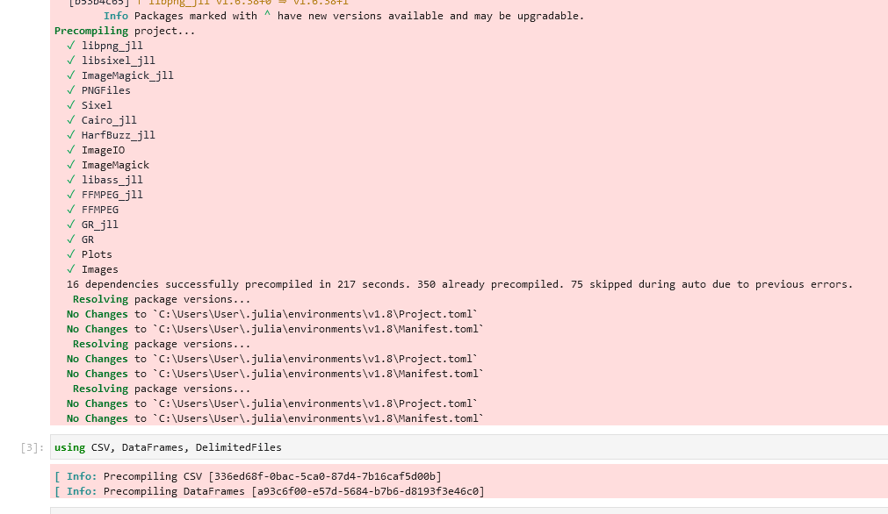{#fig:002 width=70%}

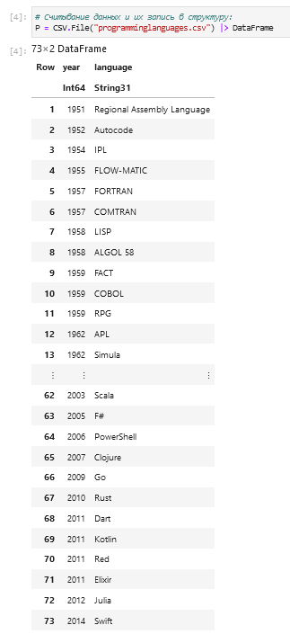{#fig:003 width=70%}

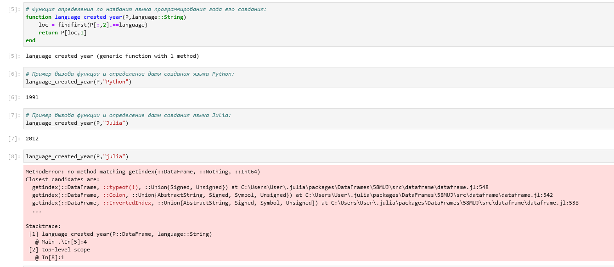{#fig:004 width=70%}

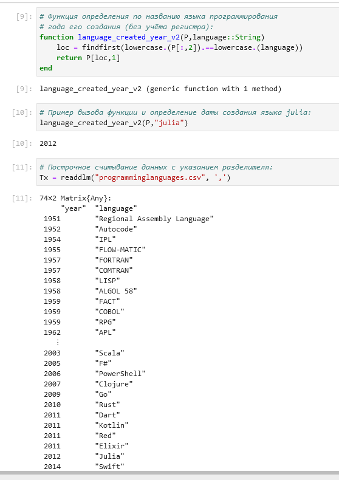{#fig:005 width=70%}

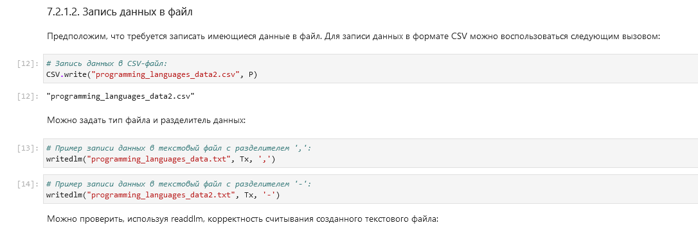{#fig:006 width=70%}

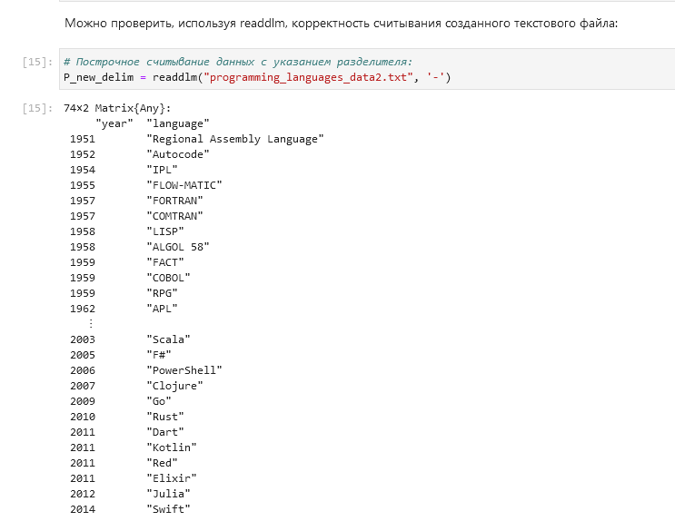{#fig:007 width=70%}

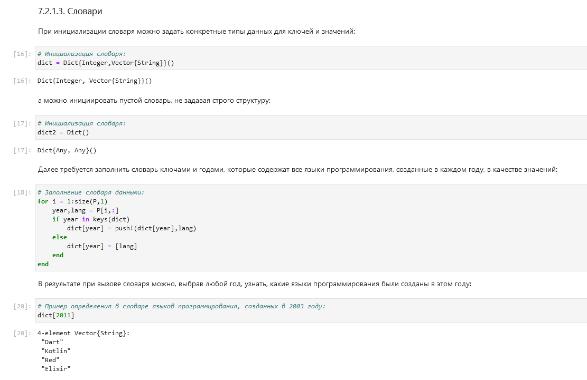{#fig:008 width=70%}

#### Запись данных в файл

Построим график и рассмотрим некоторые опции при построении ([@fig:009-@fig:016]).

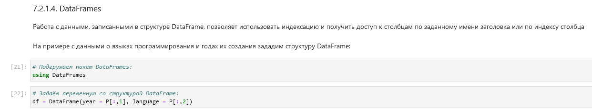{#fig:009 width=70%}

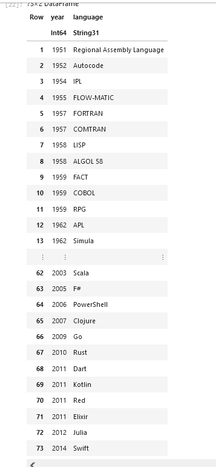{#fig:010 width=70%}

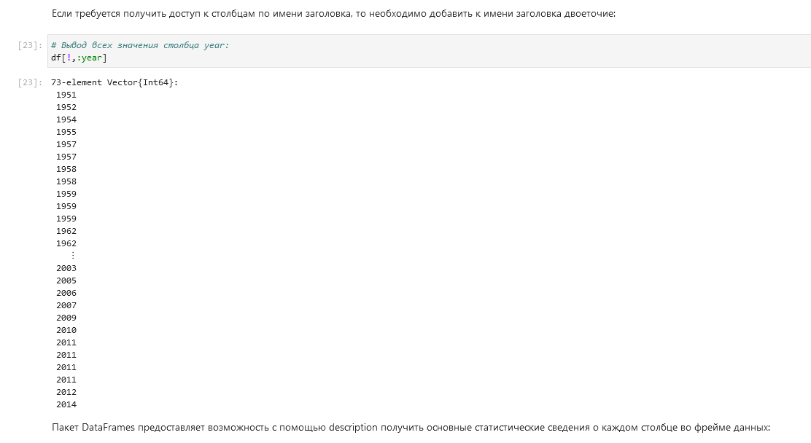{#fig:011 width=70%}

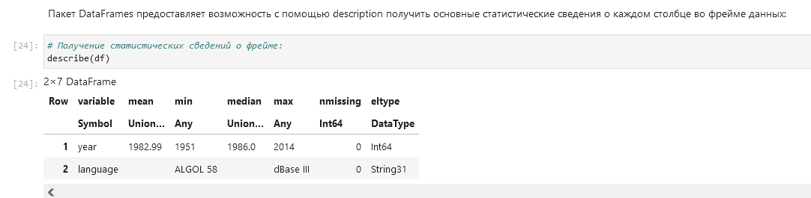{#fig:012 width=70%}

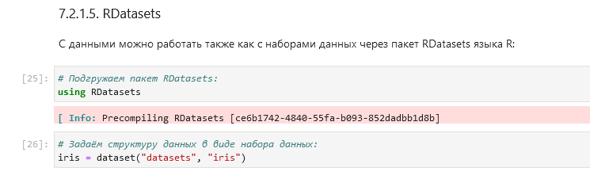{#fig:013 width=70%}

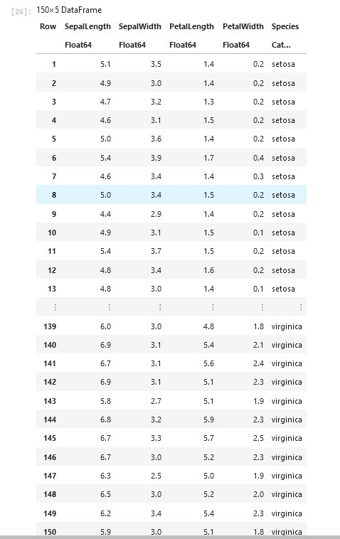{#fig:014 width=70%}

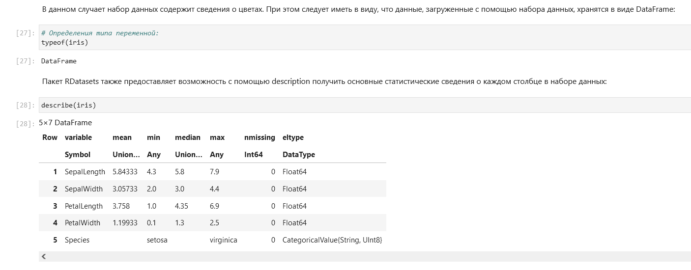{#fig:015 width=70%}

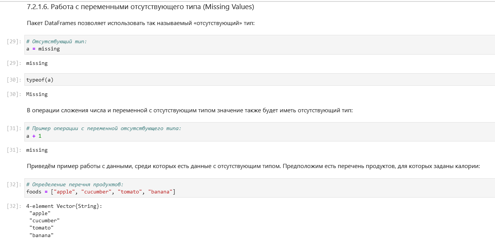{#fig:016 width=70%}

#### Словари

При работе с данными бывает удобно записать их в формате словаря.

Предположим, что словарь должен содержать перечень всех языков программирования
и года их создания, при этом при указании года выводить все языки программирования,
созданные в этом году.

Зададим некоторую функцию, похожую на экспоненту и аппроксимируем ее ([@fig:020,@fig:021]).

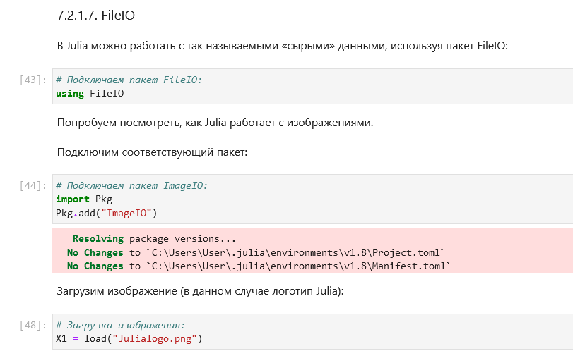{#fig:020 width=70%}

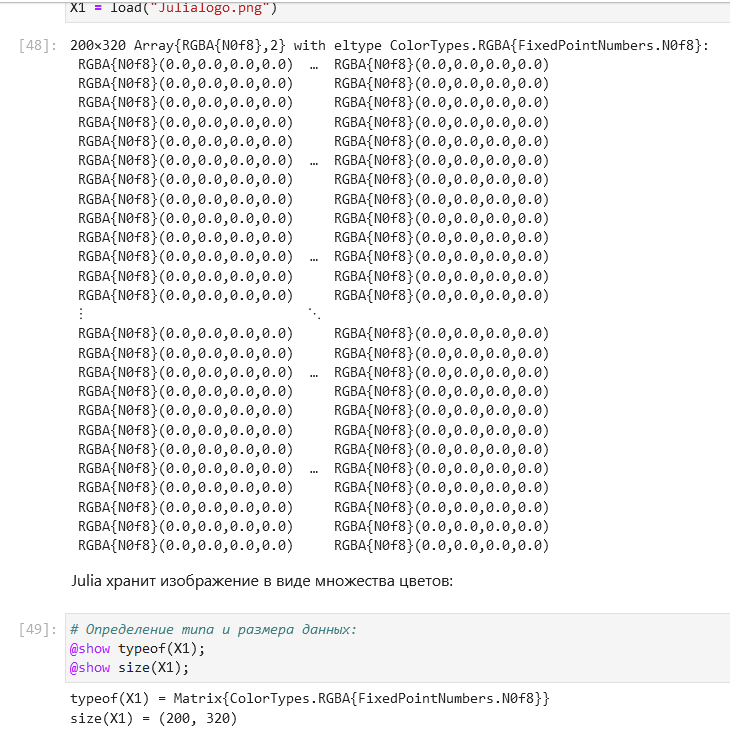{#fig:021 width=70%}

#### DataFrames

Работа с данными, записанными в структуре DataFrame, позволяет использовать индексацию и получить доступ к столбцам по заданному имени заголовка или по индексу столбца.

Зададим некоторую функцию, похожую на экспоненту и аппроксимируем ее ([@fig:020,@fig:021]).

{#fig:020 width=70%}

{#fig:021 width=70%}

#### RDatasets

Зададим некоторую функцию, похожую на экспоненту и аппроксимируем ее ([@fig:020,@fig:021]).

{#fig:020 width=70%}

{#fig:021 width=70%}

#### Работа с переменными отсутствующего типа (Missing Values)

Зададим некоторую функцию, похожую на экспоненту и аппроксимируем ее ([@fig:020,@fig:021]).

{#fig:020 width=70%}

{#fig:021 width=70%}

#### FileIO

Зададим некоторую функцию, похожую на экспоненту и аппроксимируем ее ([@fig:020,@fig:021]).

{#fig:020 width=70%}

{#fig:021 width=70%}

### Обработка данных: стандартные алгоритмы машинного обучения в Julia

#### Кластеризация данных. Метод k-средних

Задача кластеризации данных заключается в формировании однородной группы упорядоченных по какому-то признаку данных.

Метод k-средних позволяет минимизировать суммарное квадратичное отклонение точек кластеров от центров этих кластеров:
$$
𝑉 = \sum_{i=1}^{k} \sum_{x \in S_i} (x - \mu_i)^2,
$$
где $𝑆_𝑖$, $𝑖 = 1, 2, \dots, 𝑘$ --- полученные кластеры, $k$ --- число кластеров, $\mu_𝑖$ --- центры масс (главные точки или объекты кластера) всех векторов $x$ из кластера $S_i$.

Зададим некоторую функцию, похожую на экспоненту и аппроксимируем ее ([@fig:020,@fig:021]).

{#fig:020 width=70%}

{#fig:021 width=70%}

#### Кластеризация данных. Метод k ближайших соседей

Данный метод заключается в отнесении объекта к тому из известных классов, который является наиболее распространённым среди $k$ соседей данного элемента. В случае использования метода для регрессии, объекту присваивается среднее значение по $k$ ближайшим к нему объектам.

Зададим некоторую функцию, похожую на экспоненту и аппроксимируем ее ([@fig:020,@fig:021]).

{#fig:020 width=70%}

{#fig:021 width=70%}

#### Обработка данных. Метод главных компонент

Метод главных компонент (Principal Components Analysis, PCA) позволяет уменьшить
размерность данных, потеряв наименьшее количество полезной информации. Метод
имеет широкое применение в различных областях знаний, например, при визуализации
данных, компрессии изображений, в эконометрике, некоторых гуманитарных предметных областях, например, в социологии или в политологии.

Зададим некоторую функцию, похожую на экспоненту и аппроксимируем ее ([@fig:020,@fig:021]).

{#fig:020 width=70%}

{#fig:021 width=70%}

#### Обработка данных. Линейная регрессия

Регрессионный анализ представляет собой набор статистических методов исследования влияния одной или нескольких независимых переменных (регрессоров) на
зависимую (критериальная) переменную. Терминология зависимых и независимых
переменных отражает лишь математическую зависимость переменных, а не причинно-следственные отношения.

Наиболее распространённый вид регрессионного анализа --- линейная регрессия, когда
находят линейную функцию, которая согласно определённым математическим критериям наиболее соответствует данным.

Зададим некоторую функцию, похожую на экспоненту и аппроксимируем ее ([@fig:020,@fig:021]).

{#fig:020 width=70%}

{#fig:021 width=70%}

## Самостоятельная работа

### Кластеризация

Используя `Clustering.jl` для кластеризации на основе k-средних, сделаем точечную диаграмму полученных кластеров.

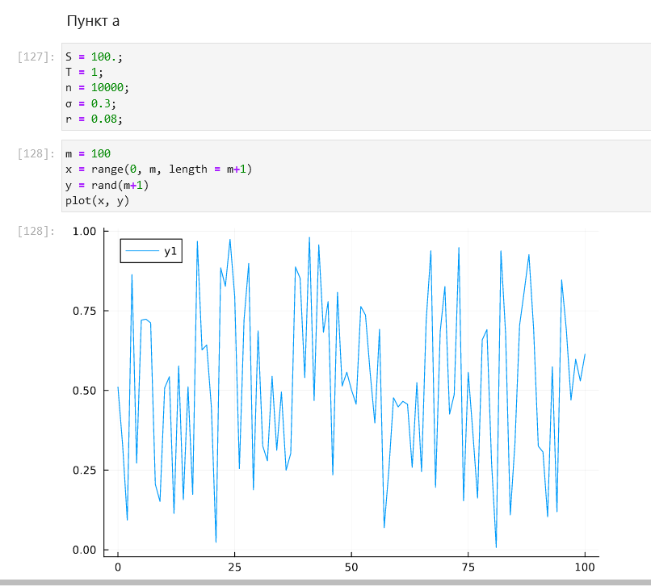{#fig:074 width=70%}

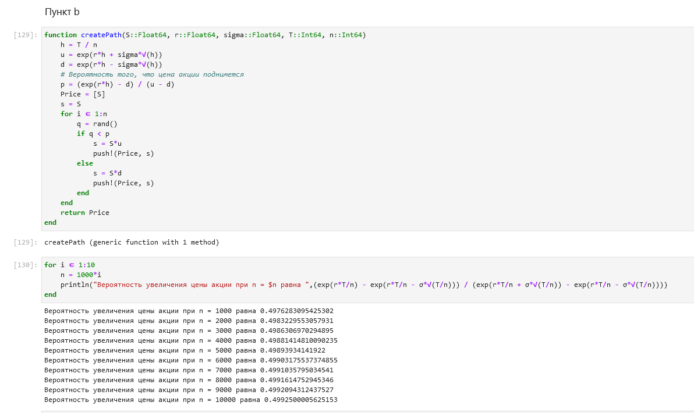{#fig:075 width=70%}

### Регрессия (метод наименьших квадратов в случае линейной регрессии)

{#fig:074 width=70%}

{#fig:075 width=70%}

### Модель ценообразования биномиальных опционов

{#fig:074 width=70%}

{#fig:075 width=70%}

# Выводы

В ходе выполнения лабораторной работы я освоил специализированные пакеты в Julia для обработки данных.

# Список литературы{.unnumbered}

::: {#refs}
:::
