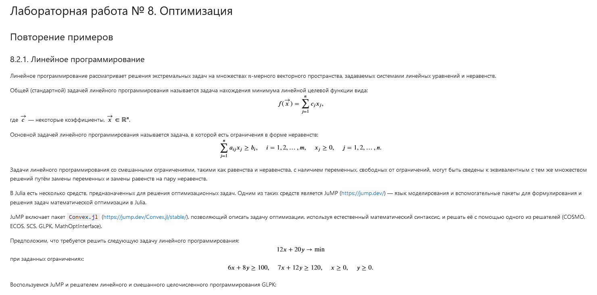
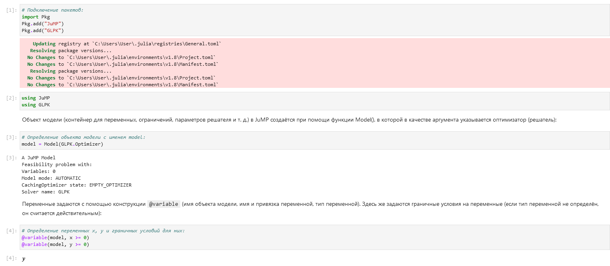
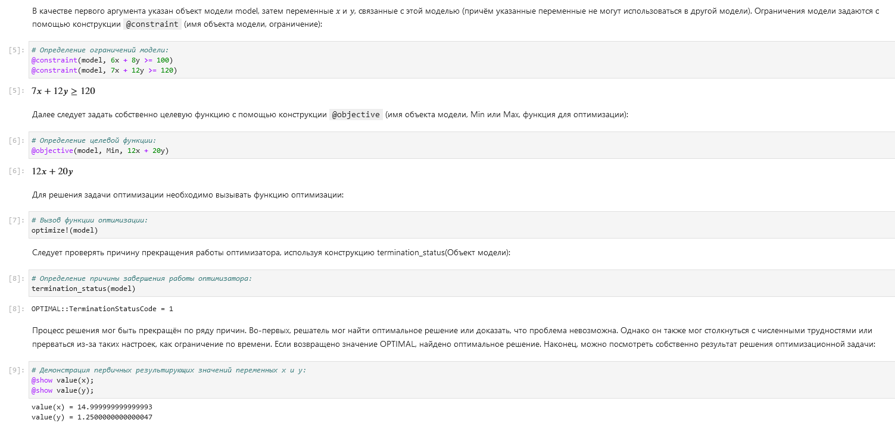
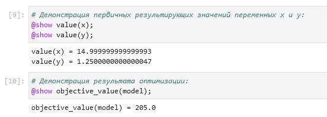
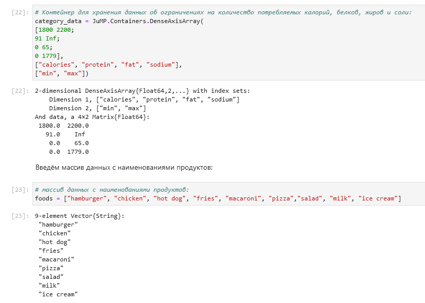
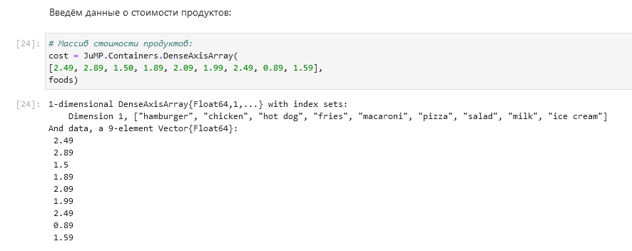
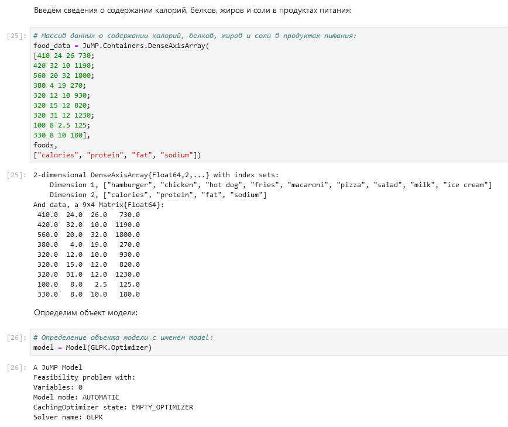
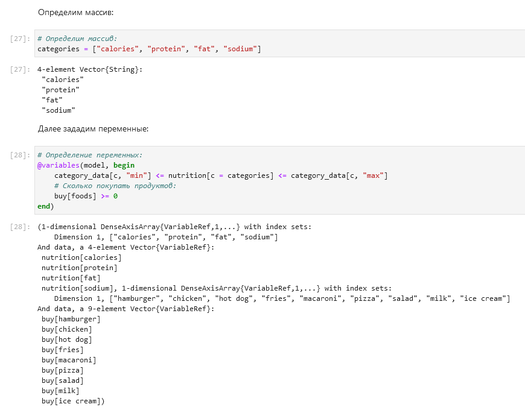
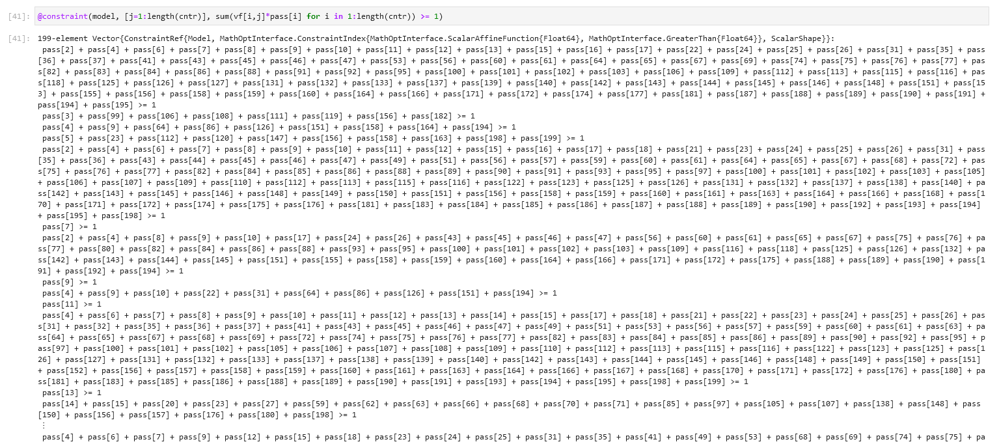
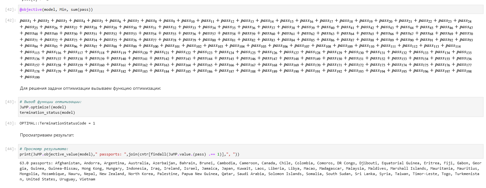

---
## Front matter
lang: ru-RU
title: Лабораторная работа №8
subtitle: Компьютерный практикум по статистическому анализу данных
author:
  - Николаев Д. И.
institute:
  - Российский университет дружбы народов, Москва, Россия
date: 14 декабря 2023

## i18n babel
babel-lang: russian
babel-otherlangs: english

## Formatting pdf
toc: false
toc-title: Содержание
slide_level: 2
aspectratio: 169
section-titles: true
theme: metropolis
header-includes:
 - \metroset{progressbar=frametitle,sectionpage=progressbar,numbering=fraction}
 - '\makeatletter'
 - '\beamer@ignorenonframefalse'
 - '\makeatother'
---

# Прагматика выполнения

- Получение навыков работы в Jupyter Notebook;
- Освоение особенностей языка Julia;
- Применение полученных знаний на практике в дальнейшем.

# Цели

Основная цель работа --- освоить пакеты Julia для решения задач оптимизации

# Задачи

1. Используя Jupyter Lab, повторите примеры из раздела 8.2.
2. Выполните задания для самостоятельной работы (раздел 8.4).

# Повторение примеров

## Линейное программирование (1)

{#fig:001 width=70%}

## Линейное программирование (2)

{#fig:002 width=70%}

## Линейное программирование (3)

{#fig:003 width=70%}

## Линейное программирование (4)

{#fig:004 width=70%}

## Векторизованные ограничения и целевая функция оптимизации (1)

{#fig:009 width=70%}

## Векторизованные ограничения и целевая функция оптимизации (2)

{#fig:010 width=70%}

## Векторизованные ограничения и целевая функция оптимизации (3)

{#fig:011 width=70%}

## Векторизованные ограничения и целевая функция оптимизации (4)

{#fig:012 width=70%}

## Оптимизация рациона питания (1)

{#fig:020 width=70%}

## Оптимизация рациона питания (2)

{#fig:021 width=70%}

## Путешествие по миру (1)

{#fig:020 width=70%}

## Путешествие по миру (2)

{#fig:021 width=70%}

## Портфельные инвестиции (1)

{#fig:020 width=70%}

## Портфельные инвестиции (2)

{#fig:021 width=70%}

## Восстановление изображения (1)

{#fig:020 width=70%}

## Восстановление изображения (2)

{#fig:021 width=70%}

# Самостоятельное задание

## Задание 8.4.1. Линейное программирование (1)

{#fig:074 width=70%}

## Задание 8.4.1. Линейное программирование (2)

{#fig:075 width=70%}

## Задание 8.4.2. Линейное программирование. Использование массивов (1)

{#fig:076 width=70%}

## Задание 8.4.2. Линейное программирование. Использование массивов (2)

{#fig:077 width=70%}

## Задание 8.4.3. Выпуклое программирование (1)

{#fig:078 width=70%}

## Задание 8.4.3. Выпуклое программирование (2)

{#fig:079 width=70%}

## Задание 8.4.4. Оптимальная рассадка по залам (1)

{#fig:078 width=70%}

## Задание 8.4.4. Оптимальная рассадка по залам (2)

{#fig:079 width=70%}

## Задание 8.4.5. План приготовления кофе (1)

{#fig:078 width=70%}

## Задание 8.4.5. План приготовления кофе (2)

{#fig:079 width=70%}

# Результаты

В ходе работы я освоил пакеты Julia для решения задач оптимизации
