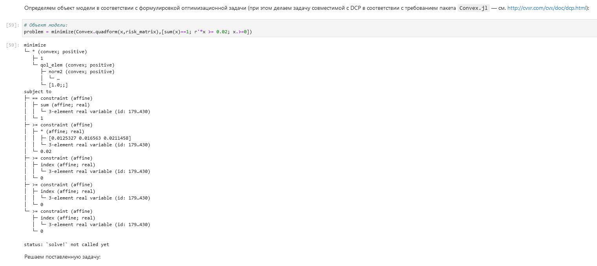

---
## Front matter
lang: ru-RU
title: Лабораторная работа №8
subtitle: Компьютерный практикум по статистическому анализу данных
author:
  - Николаев Д. И.
institute:
  - Российский университет дружбы народов, Москва, Россия
date: 29 декабря 2023

## i18n babel
babel-lang: russian
babel-otherlangs: english

## Formatting pdf
toc: false
toc-title: Содержание
slide_level: 2
aspectratio: 169
section-titles: true
theme: metropolis
header-includes:
 - \metroset{progressbar=frametitle,sectionpage=progressbar,numbering=fraction}
 - '\makeatletter'
 - '\beamer@ignorenonframefalse'
 - '\makeatother'
---

# Прагматика выполнения

- Получение навыков работы в Jupyter Notebook;
- Освоение особенностей языка Julia;
- Применение полученных знаний на практике в дальнейшем.

# Цели

Основная цель работа --- освоить пакеты Julia для решения задач оптимизации

# Задачи

1. Используя Jupyter Lab, повторите примеры из раздела 8.2.
2. Выполните задания для самостоятельной работы (раздел 8.4).

# Повторение примеров

## Линейное программирование (1)

{#fig:001 width=70%}

## Линейное программирование (2)

{#fig:002 width=70%}

## Линейное программирование (3)

{#fig:003 width=70%}

## Линейное программирование (4)

{#fig:004 width=70%}

## Векторизованные ограничения и целевая функция оптимизации (1)

{#fig:005 width=70%}

## Векторизованные ограничения и целевая функция оптимизации (2)

{#fig:006 width=70%}

## Векторизованные ограничения и целевая функция оптимизации (3)

{#fig:007 width=70%}

## Оптимизация рациона питания (1)

{#fig:008 width=70%}

## Оптимизация рациона питания (2)

{#fig:009 width=70%}

## Оптимизация рациона питания (3)

{#fig:010 width=70%}

## Оптимизация рациона питания (4)

{#fig:011 width=70%}

## Оптимизация рациона питания (5)

{#fig:012 width=70%}

## Оптимизация рациона питания (6)

{#fig:013 width=70%}

## Оптимизация рациона питания (7)

{#fig:014 width=70%}

## Путешествие по миру (1)

{#fig:015 width=70%}

## Путешествие по миру (2)

{#fig:016 width=70%}

## Путешествие по миру (3)

{#fig:017 width=70%}

## Путешествие по миру (4)

{#fig:018 width=70%}

## Путешествие по миру (5)

{#fig:019 width=70%}

## Путешествие по миру (6)

{#fig:020 width=70%}

## Путешествие по миру (7)

{#fig:021 width=70%}

## Портфельные инвестиции (1)

{#fig:022 width=70%}

## Портфельные инвестиции (2)

{#fig:023 width=70%}

## Портфельные инвестиции (3)

{#fig:024 width=70%}

## Портфельные инвестиции (4)

{#fig:025 width=70%}

## Портфельные инвестиции (5)

{#fig:026 width=70%}

## Портфельные инвестиции (6)

{#fig:027 width=70%}

## Портфельные инвестиции (7)

{#fig:028 width=70%}

## Портфельные инвестиции (8)

{#fig:029 width=70%}

## Портфельные инвестиции (9)

{#fig:030 width=70%}

## Портфельные инвестиции (10)

{#fig:031 width=70%}

## Восстановление изображения (1)

{#fig:032 width=70%}

## Восстановление изображения (2)

{#fig:033 width=70%}

## Восстановление изображения (3)

{#fig:034 width=70%}

## Восстановление изображения (4)

{#fig:035 width=70%}

## Восстановление изображения (5)

{#fig:036 width=70%}

## Восстановление изображения (6)

{#fig:037 width=70%}

## Восстановление изображения (7)

{#fig:038 width=70%}

## Восстановление изображения (8)

{#fig:039 width=70%}

## Восстановление изображения (9)

{#fig:040 width=70%}

# Самостоятельное задание

## Задание 8.4.1. Линейное программирование (1)

{#fig:041 width=70%}

## Задание 8.4.1. Линейное программирование (2)

{#fig:042 width=70%}

## Задание 8.4.2. Линейное программирование. Использование массивов (1)

{#fig:043 width=70%}

## Задание 8.4.2. Линейное программирование. Использование массивов (2)

{#fig:044 width=70%}

## Задание 8.4.3. Выпуклое программирование (1)

{#fig:045 width=70%}

## Задание 8.4.3. Выпуклое программирование (2)

{#fig:046 width=70%}

## Задание 8.4.3. Выпуклое программирование (3)

{#fig:047 width=70%}

## Задание 8.4.3. Выпуклое программирование (4)

{#fig:048 width=70%}

## Задание 8.4.4. Оптимальная рассадка по залам (1)

{#fig:049 width=70%}

## Задание 8.4.4. Оптимальная рассадка по залам (2)

{#fig:050 width=70%}

## Задание 8.4.4. Оптимальная рассадка по залам (3)

{#fig:051 width=70%}

## Задание 8.4.4. Оптимальная рассадка по залам (4)

{#fig:052 width=70%}

## Задание 8.4.4. Оптимальная рассадка по залам (5)

{#fig:053 width=70%}

## Задание 8.4.4. Оптимальная рассадка по залам (6)

{#fig:054 width=70%}

## Задание 8.4.4. Оптимальная рассадка по залам (7)

{#fig:055 width=70%}

## Задание 8.4.5. План приготовления кофе (1)

{#fig:056 width=70%}

## Задание 8.4.5. План приготовления кофе (2)

{#fig:057 width=70%}

# Результаты

В ходе работы я освоил пакеты Julia для решения задач оптимизации
