---
## Front matter
title: "Лабораторная работа №8"
subtitle: "Компьютерный практикум по статистическому анализу данных"
author: "Николаев Дмитрий Иванович"

## Generic otions
lang: ru-RU
toc-title: "Содержание"

## Bibliography
bibliography: bib/cite.bib
csl: pandoc/csl/gost-r-7-0-5-2008-numeric.csl

## Pdf output format
toc: true # Table of contents
toc-depth: 2
lof: true # List of figures
lot: true # List of tables
fontsize: 12pt
linestretch: 1.5
papersize: a4
documentclass: scrreprt
## I18n polyglossia
polyglossia-lang:
  name: russian
  options:
	- spelling=modern
	- babelshorthands=true
polyglossia-otherlangs:
  name: english
## I18n babel
babel-lang: russian
babel-otherlangs: english
## Fonts
mainfont: PT Serif
romanfont: PT Serif
sansfont: PT Sans
monofont: PT Mono
mainfontoptions: Ligatures=TeX
romanfontoptions: Ligatures=TeX
sansfontoptions: Ligatures=TeX,Scale=MatchLowercase
monofontoptions: Scale=MatchLowercase,Scale=0.9
## Biblatex
biblatex: true
biblio-style: "gost-numeric"
biblatexoptions:
  - parentracker=true
  - backend=biber
  - hyperref=auto
  - language=auto
  - autolang=other*
  - citestyle=gost-numeric
## Pandoc-crossref LaTeX customization
figureTitle: "Рис."
tableTitle: "Таблица"
listingTitle: "Листинг"
lofTitle: "Список иллюстраций"
lotTitle: "Список таблиц"
lolTitle: "Листинги"
## Misc options
indent: true
header-includes:
  - \usepackage{indentfirst}
  - \usepackage{float} # keep figures where there are in the text
  - \floatplacement{figure}{H} # keep figures where there are in the text
---

# Цель работы

Основная цель работа --- освоить пакеты Julia для решения задач оптимизации.

# Выполнение лабораторной работы

Под оптимизацией в математике и информатике понимается решение задачи нахождения экстремума (минимума или максимума) целевой функции в некоторой области конечномерного векторного пространства, ограниченной набором линейных и/или нелинейных равенств и/или неравенств.

Оптимизационной задачей называется задача определения наилучших с точки зрения
структуры или значений параметров объектов.

## Повторение примеров

Повторим примеры, представленные в лабораторной работе ([@lab8]).

### Линейное программирование

Линейное программирование рассматривает решения экстремальных задач на множествах 𝑛-мерного векторного пространства, задаваемых системами линейных уравнений
и неравенств.

Общей (стандартной) задачей линейного программирования называется задача нахождения минимума линейной целевой функции вида:
$$
f(\overrightarrow{x}) = \sum_{j=1}^{n} c_jx_j,
$$
где $\overrightarrow{c}$ --- некоторые коэффициенты, $\overrightarrow{x} \in \mathbb{R}^n$.

Основной задачей линейного программирования называется задача, в которой есть
ограничения в форме неравенств:
$$
\sum_{j=1}^{n} a_{ij}x_j \geq b_i, \quad i = 1, 2, \dots, m, \quad x_j \geq 0, \quad j = 1, 2, \dots, n.
$$

Задачи линейного программирования со смешанными ограничениями, такими как
равенства и неравенства, с наличием переменных, свободных от ограничений, могут быть
сведены к эквивалентным с тем же множеством решений путём замены переменных
и замены равенств на пару неравенств.

В Julia есть несколько средств, предназначенных для решения оптимизационных задач.
Одним из таких средств является JuMP --- язык моделирования
и вспомогательные пакеты для формулирования и решения задач математической оптимизации в Julia.

JuMP включает пакет `Convex.jl`, позволяющий описать задачу оптимизации, используя естественный математический синтаксис,
и решать её с помощью одного из решателей (COSMO, ECOS, SCS, GLPK, MathOptInterface).

Предположим, что требуется решить следующую задачу линейного программирования:
$$
12x + 20y \rightarrow \min
$$
при заданных ограничениях:
$$
6x + 8y \geq 100, \quad 7x + 12y \geq 120, \quad x \geq 0, \quad y \geq 0.
$$

Подключим пакеты и построим простой график ([@fig:001-@fig:008]).

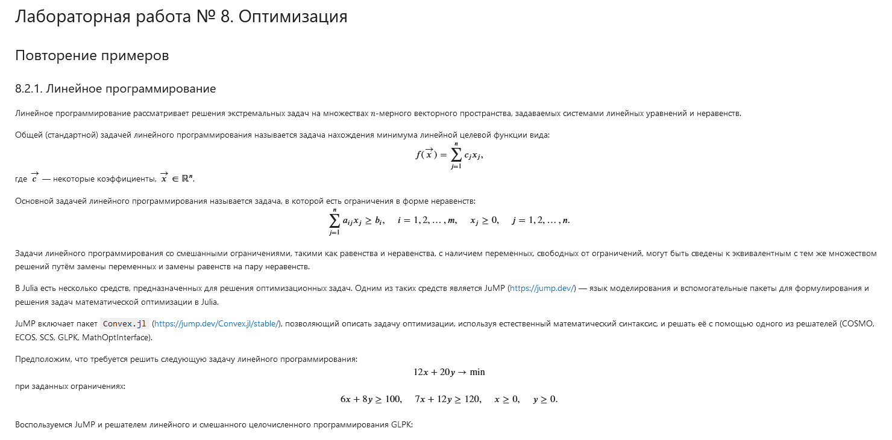{#fig:001 width=70%}

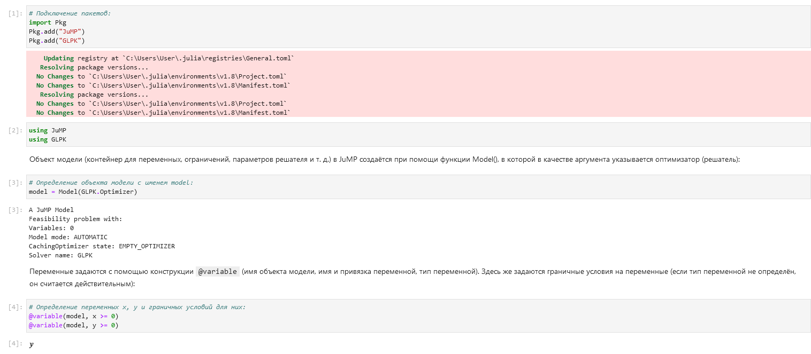{#fig:002 width=70%}

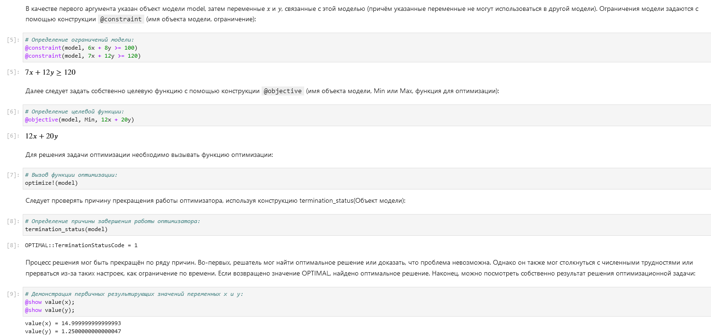{#fig:003 width=70%}

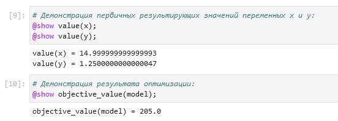{#fig:004 width=70%}

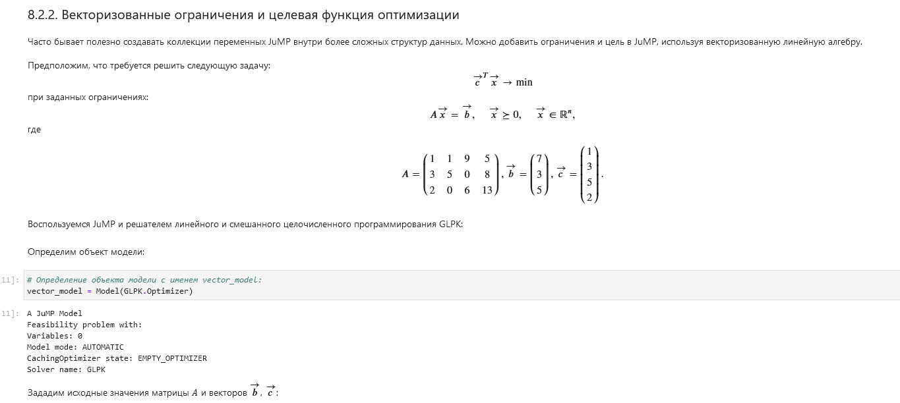{#fig:005 width=70%}

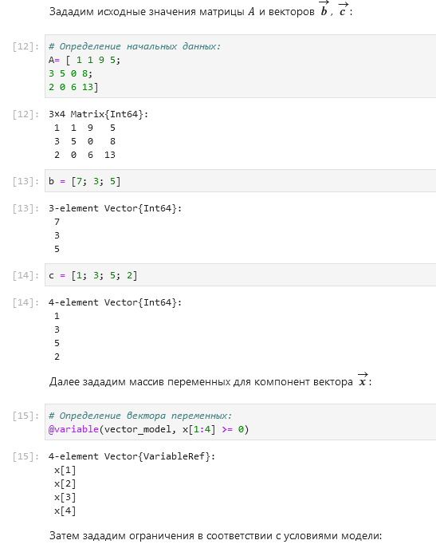{#fig:006 width=70%}

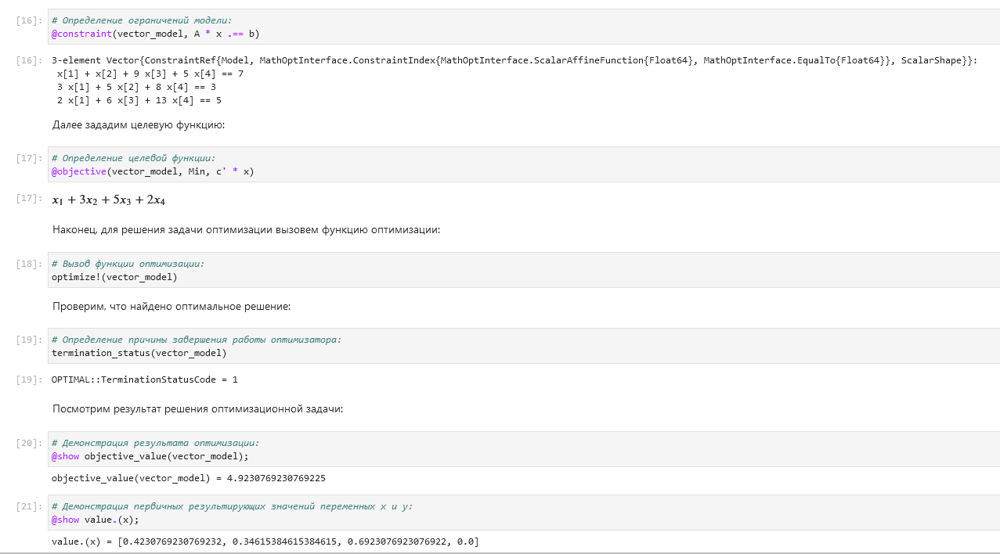{#fig:007 width=70%}

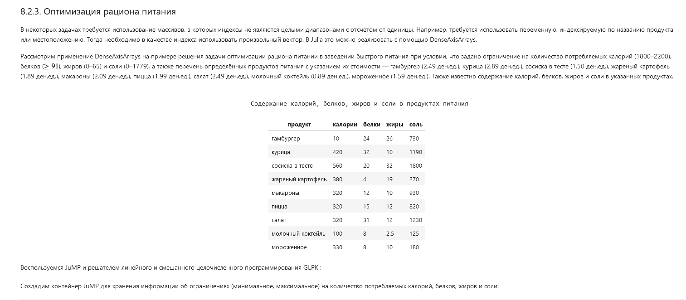{#fig:008 width=70%}

### Векторизованные ограничения и целевая функция оптимизации

Часто бывает полезно создавать коллекции переменных JuMP внутри более сложных
структур данных. Можно добавить ограничения и цель в JuMP, используя векторизованную линейную алгебру.

Предположим, что требуется решить следующую задачу:
$$
\overrightarrow{c}^T \overrightarrow{x} \rightarrow \min
$$
при заданных ограничениях:
$$
A\overrightarrow{x} = \overrightarrow{b}, \quad \overrightarrow{x} \succeq 0, \quad \overrightarrow{x} \in \mathbb{R}^n,
$$
где

$$
A = \begin{pmatrix}
1 & 1 & 9 & 5 \\
3 & 5 & 0 & 8 \\
2 & 0 & 6 & 13
\end{pmatrix},
\overrightarrow{b} = \begin{pmatrix}
7 \\
3 \\
5
\end{pmatrix},
\overrightarrow{c} = \begin{pmatrix}
1 \\
3 \\
5 \\
2
\end{pmatrix}.
$$

Подключим пакеты и построим простой график ([@fig:001-@fig:008]).

{#fig:001 width=70%}

{#fig:002 width=70%}

{#fig:003 width=70%}

{#fig:004 width=70%}

{#fig:005 width=70%}

{#fig:006 width=70%}

{#fig:007 width=70%}

{#fig:008 width=70%}

### Оптимизация рациона питания

В некоторых задачах требуется использование массивов, в которых индексы не являются целыми диапазонами с отсчётом от единицы. Например, требуется использовать
переменную, индексируемую по названию продукта или местоположению. Тогда необходимо в качестве индекса использовать произвольный вектор. В Julia это можно
реализовать с помощью DenseAxisArrays.

Рассмотрим применение DenseAxisArrays на примере решения задачи оптимизации
рациона питании в заведении быстрого питания при условии, что задано ограничение
на количество потребляемых калорий (1800--2200), белков ($\geq 91$), жиров (0--65) и соли
(0--1779), а также перечень определённых продуктов питания с указанием их стоимости
--- гамбургер (2.49 ден.ед.), курица (2.89 ден.ед.), сосиска в тесте (1.50 ден.ед.), жареный
картофель (1.89 ден.ед.), макароны (2.09 ден.ед.), пицца (1.99 ден.ед.), салат (2.49 ден.ед.),
молочный коктейль (0.89 ден.ед.), мороженное (1.59 ден.ед.). Также известно содержание
калорий, белков, жиров и соли в указанных продуктах.

                                                                Содержание калорий, белков, жиров и соли в продуктах питания
| продукт | калории | белки | жиры | соль |
|---------|---------|-------|------|------|
| гамбургер | 10 | 24 | 26 | 730 |
| курица | 420 | 32 | 10 | 1190 |
| сосиска в тесте | 560 | 20 | 32 | 1800 |
| жареный картофель | 380 | 4 | 19 | 270 |
| макароны | 320 | 12 | 10 | 930 |
| пицца | 320 | 15 | 12 | 820 |
| салат | 320 | 31 | 12 | 1230 |
| молочный коктейль | 100 | 8 | 2.5 | 125 |
| мороженное | 330 | 8 | 10 | 180 |

Построим график и рассмотрим некоторые опции при построении ([@fig:009-@fig:016]).

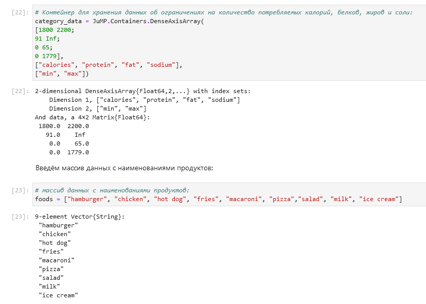{#fig:009 width=70%}

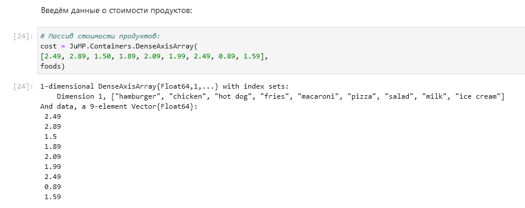{#fig:010 width=70%}

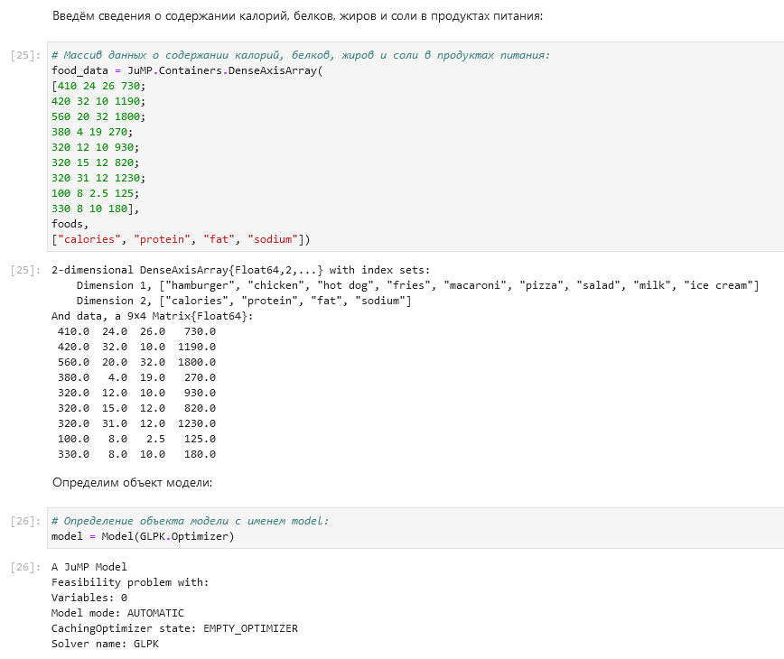{#fig:011 width=70%}

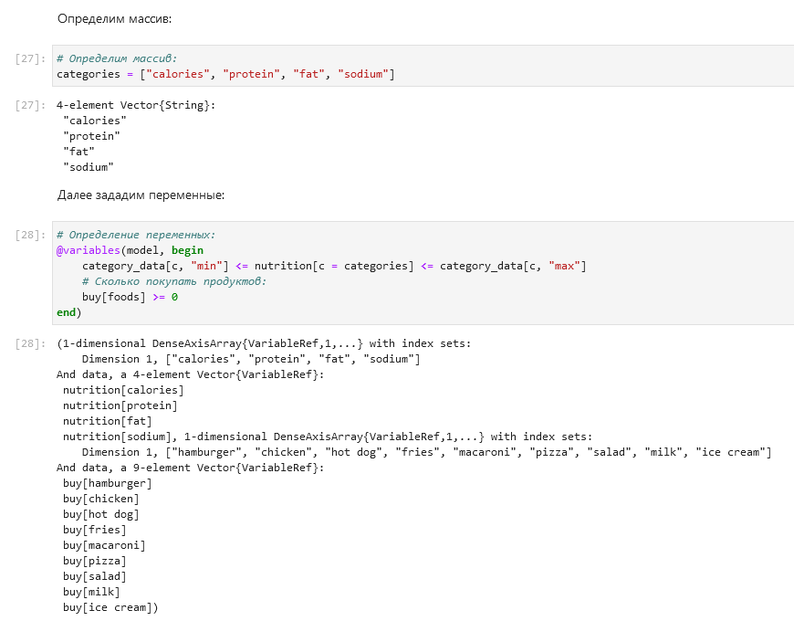{#fig:012 width=70%}

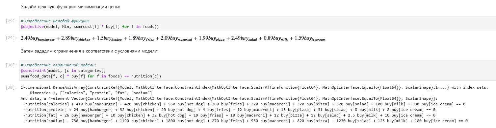{#fig:013 width=70%}

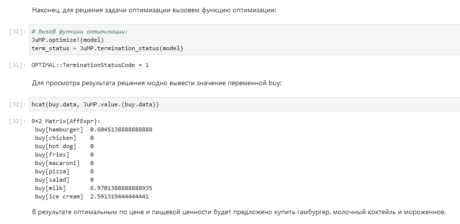{#fig:014 width=70%}

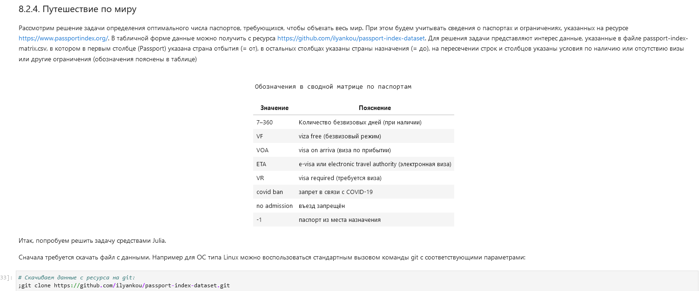{#fig:015 width=70%}

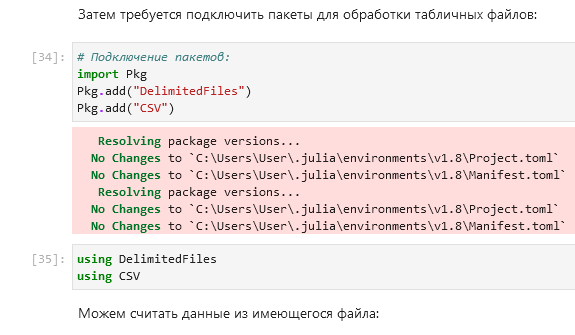{#fig:016 width=70%}

### Путешествие по миру

Рассмотрим решение задачи определения оптимального числа паспортов, требующихся, чтобы объехать весь мир. При этом будем учитывать сведения о паспортах
и ограничениях, указанных на ресурсе <https://www.passportindex.org/>. В табличной форме данные можно получить с ресурса <https://github.com/ilyankou/passport-index-dataset>. Для решения задачи представляют интерес данные, указанные в файле passport-index-matrix.csv, в котором в первым столбце (Passport) указана страна отбытия (= от), в остальных столбцах указаны страны назначения (= до), на пересечении строк и столбцов указаны условия по наличию или отсутствию визы или другие ограничения (обозначения пояснены в таблице)

                                                                Обозначения в сводной матрице по паспортам
| Значение | Пояснение |
|----------|-----------|
| 7–360 | Количество безвизовых дней (при наличии) |
| VF | viza free (безвизовый режим) |
| VOA | visa on arriva (виза по прибытии) |
| ETA | e-visa или electronic travel authority (электронная виза) |
| VR | visa required (требуется виза) |
| covid ban | запрет в связи с COVID-19 |
| no admission | въезд запрещён |
| -1 | паспорт из места назначения |

Зададим некоторую функцию, похожую на экспоненту и аппроксимируем ее ([@fig:020,@fig:021]).

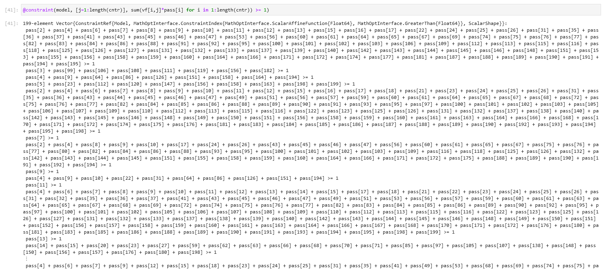{#fig:020 width=70%}

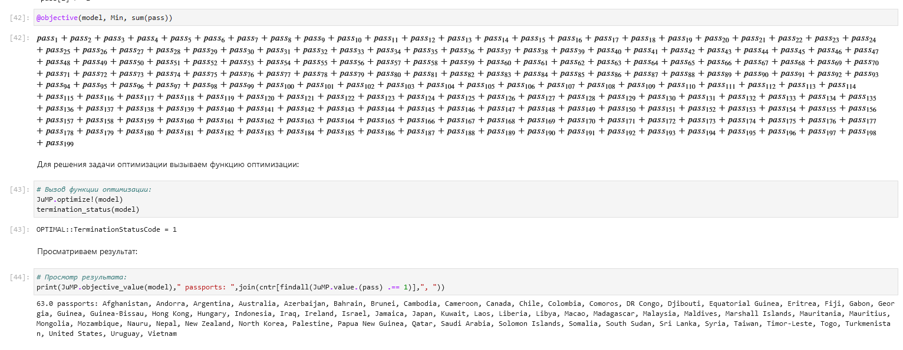{#fig:021 width=70%}

### Портфельные инвестиции

Портфельные инвестиции --- размещение капитала в ценные бумаги, формируемые
в виде портфеля ценных бумаг, с целью получения прибыли.

Инвестиционный портфель --- процесс стратегического управления капиталом как
оптимизированной, единой системой инвестиционных ценностей.

Предположим требуется решить оптимизационную задачу в следующей формулировке.
Имеется капитал в 1000 ден. ед., который планируется инвестировать в три компании ---
Microsoft, Facebook, Apple. При этом есть данные еженедельных значений цен на акции
этих компаний за определённый период времени. Необходимо определить доходность
акций каждой компании за рассматриваемый период времени, после чего инвестировать
в эти три компании так, чтобы получить возврат в размере не менее 2% от вложенной
суммы.

Для решения оптимизационной задачи будем использовать пакет `Convex.jl` и оптимизатор (решатель) SCS. Кроме того, понадобится пакет `Statistics.jl` для получения матрицы рисков на основе расчёта ковариационных значений по доходности.

Зададим некоторую функцию, похожую на экспоненту и аппроксимируем ее ([@fig:020,@fig:021]).

{#fig:020 width=70%}

{#fig:021 width=70%}

### Восстановление изображения

Предположим есть изображение, на котором были изменены некоторые пиксели. Требуется восстановить неизвестные пиксели путём решения задачи оптимизации.

Зададим некоторую функцию, похожую на экспоненту и аппроксимируем ее ([@fig:020,@fig:021]).

{#fig:020 width=70%}

{#fig:021 width=70%}

## Самостоятельная работа

### Линейное программирование

Решим задачу линейного программирования:
$$
x_1 + 2x_2 + 5x_3 \rightarrow \max,
$$
при заданных ограничениях:
$$
-x_1 + x_2 + 3x_3 \leq -5, \quad x_1 + 3x_2 - 7x_3 \leq 10, \quad 0 \leq x_1 \leq 10, \quad x_2 \geq 0, \quad x_3 \geq 0.
$$

{#fig:074 width=70%}

{#fig:075 width=70%}

### Линейное программирование. Использование массивов

Решим предыдущее задание, используя массивы вместо скалярных переменных.

{#fig:074 width=70%}

{#fig:075 width=70%}

### Выпуклое программирование

Решим задачу оптимизации:
$$
\big|\big|A\overrightarrow{x} - \overrightarrow{b}\big|\big|^2_2 \rightarrow \min
$$
при заданных ограничениях:
$$
\overrightarrow{x} \succeq 0,
$$
где $\overrightarrow{x} \in \mathbb{R}^n$, $A \in \mathbb{R}^{m \times n}$, $\overrightarrow{b} \in \mathbb{R}^m $.

Матрицу $A$ и вектор $\overrightarrow{b}$ зададим случайным образом.

Для решения задачи используем пакет Convex и решатель SCS.

{#fig:074 width=70%}

{#fig:075 width=70%}

### Оптимальная рассадка по залам

Проводится конференция с 5 разными секциями. Забронировано 5 залов различной
вместимости: в каждом зале не должно быть меньше 180 и больше 250 человек, а на
третьей секции активность подразумевает, что должно быть точно 220 человек.

В заявке участник указывает приоритет посещения секции: 1 — максимальный приоритет, 3 — минимальный, а значение 10000 означает, что человек не пойдёт на эту секцию.

Организаторам удалось собрать 1000 заявок с указанием приоритета посещения трёх
секций. Необходимо дать рекомендацию слушателю, на какую же секцию ему пойти,
чтобы хватило места всем.

Для решения задачи используем пакет Convex и решатель GLPK.

Приоритеты по слушателям распределим случайным образом.

{#fig:074 width=70%}

{#fig:075 width=70%}

### План приготовления кофе

Кофейня готовит два вида кофе «Раф кофе» за 400 рублей и «Капучино» за 300. Чтобы
сварить 1 чашку «Раф кофе» необходимо: 40 гр. зёрен, 140 гр. молока и 5 гр. ванильного
сахара. Для того чтобы получить одну чашку «Капучино» необходимо потратить: 30 гр.
зёрен, 120 гр. молока. На складе есть: 500 гр. зёрен, 2000 гр. молока и 40 гр. ванильного
сахара.

Необходимо найти план варки кофе, обеспечивающий максимальную выручку от их
реализации. При этом необходимо потратить весь ванильный сахар.

Для решения задачи используем пакет JuMP и решатель GLPK.

{#fig:074 width=70%}

{#fig:075 width=70%}

# Выводы

В ходе выполнения лабораторной работы я освоил пакеты Julia для решения задач оптимизации.

# Список литературы{.unnumbered}

::: {#refs}
:::
